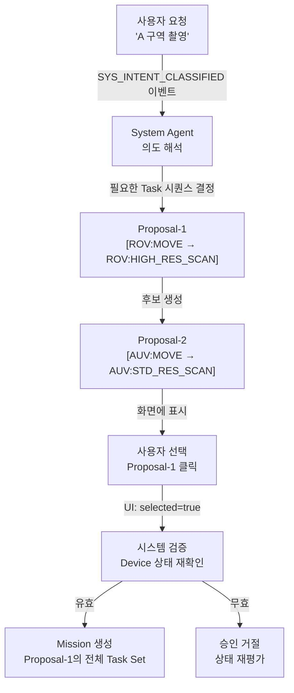

# ADR-002: Proposal as Solution Set

**상태**: Accepted  
**작성일**: 2026-05-12  
**선행 ADR**: ADR-001 (Core Design Philosophy)

---

## 상황 (Context)

사용자가 "A 구역 수중 촬영" 이라고 요청했을 때, 시스템은 이를 여러 방식으로 수행 가능한 추천안을 제시합니다.

**문제**:

- 사용자가 개별 Task를 조합해 선택하면 (예: ROV의 Task-A + USV의 Task-B), 시스템이 미리 계산하지 못한 **충돌이나 순서 문제** 발생 가능
- "Task 조합을 사용자가 한다" = "시스템의 계획 책임을 사용자에게 넘김" = 복잡도 폭증

---

## 결정 (Decision)

**System Agent가 제시하는 각 Proposal은 '완전한 솔루션 세트'입니다.**

### 1️⃣ **Proposal의 정의**

```
Proposal = 사용자 요청을 충족하기 위한
           "완전하고 일관된 Task 시퀀스 한 세트"
```

- **Proposal-1**: [Device-A로 Task-1 → Device-A로 Task-2 → Device-B로 Task-3] (일관성 O)
- **Proposal-2**: [Device-C로 Task-1 → Device-D로 Task-2] (다른 선택지)
- **사용자 선택 X**: Task-A + Task-D 조합하기 (일관성 검증 불가)

### 2️⃣ **사용자 승인 흐름**



### 3️⃣ **Proposal 선택 상태 (selected 필드)**

```typescript
Proposal {
  id: string
  selected: boolean  // true = 사용자가 이 Proposal을 선택함

  // Proposal-1
  {
    status: "APPROVED",    // 승인 처리
    selected: true         // 사용자가 이 Proposal을 선택함
  }

  // Proposal-2
  {
    status: "PROPOSED",    // 그대로 유지
    selected: false        // 선택 안 함, 그대로 유지
  }
}
```

**흐름**:

1. UI에서 사용자가 Proposal-1을 클릭
2. UI가 `Proposal-1.selected = true`로 설정
3. 백엔드가 선택된 Proposal을 검증 (Device 상태 재확인)
4. 유효하면 `Proposal.status = APPROVED`로 변경
5. **Proposal에 포함된 모든 ProposalTask를 실제 Task로 일괄 변환**

### 4️⃣ **ProposalTask의 역할**

```typescript
Proposal-1 {
  id: "proposal-1"
  selected: true
  proposal_tasks: [
    {
      sequence: 1
      title: "A 구역으로 이동"
      required_action: "MOVE_TO"
      recommended_device_id: "rov-1"
    },
    {
      sequence: 2
      title: "고해상도 촬영"
      required_action: "HIGH_RES_SCAN"
      recommended_device_id: "rov-1"
    }
  ]
}
```

- **ProposalTask**: Proposal 내 Task 후보 (사용자가 보지 않음)
- 승인 시 **모든 ProposalTask가 실제 Task로 변환** (조합 불가, 순서 유지)

---

## 결과 (Consequences)

### ✅ 이점

- **일관성 보장**: System Agent가 모든 Task 순서와 Device 할당을 검증한 후 제시
- **사용자 부담 감소**: 사용자는 "어느 방안을 선택할지"만 결정 (복잡한 Task 조합 X)
- **버그 감소**: Task 순서나 Device 충돌 같은 논리적 오류 사전 차단

### ⚠️ 제약

- **개별 Task 변경 불가**: 승인 후 일부 Task만 수정/삭제 불가 → 전체 재계획 필요
- **Proposal 수 제한**: `max_proposal_options = 3` 처럼 제한 필요 (너무 많으면 사용자 혼란)

---

## 참고

- **ADR-001**: Core Design Philosophy
- **docs/core/schema.md**: Proposal, ProposalTask 스키마
- **docs/scenarios/operation.md**: 2-1. 사용자 요청 기반 작업 추천
