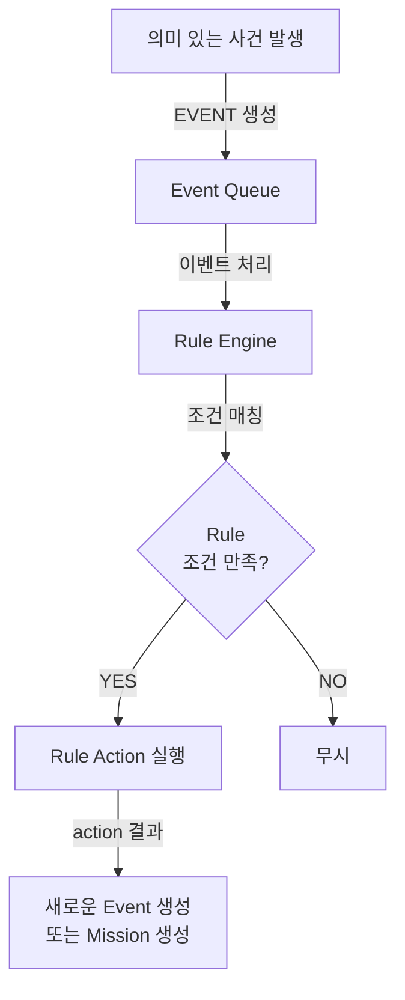

# ADR-005: Event 기반 Rule 실행

**상태**: Accepted  
**작성일**: 2026-05-12  
**선행 ADR**: ADR-001

---

## 상황

CoWater는 Policy/Rule 기반으로 문제 감지, 작업 추천, 자동 대응을 수행합니다.

**문제**:
- Rule을 "언제" 실행하는가?
  - 매 Heartbeat마다? → 부하 증가, 불필요한 반복 계산
  - 매 주기마다? → 지연 발생 가능
  - 실시간? → 정의 불명확

---

## 결정

**Rule은 특정 Event가 생성/갱신되는 시점에 실행됩니다. (Event-Triggered)**

### 1️⃣ **Rule 실행의 시점**



**핵심**:
> Rule은 매 주기마다 실행되지 않습니다.  
> **특정 Event가 발생할 때만 Rule Engine이 깨어나서 실행됩니다.**

---

### 2️⃣ **Rule 실행 시나리오**

#### **시나리오 A: 사용자 요청**

```
1. 사용자가 "A 구역 촬영해줘" 입력
   ↓
2. SYS_INTENT_CLASSIFIED 이벤트 생성
   {
     type: "SYS_INTENT_CLASSIFIED",
     actor_type: "USER",
     data: { original_request: "A 구역 촬영해줘" }
   }
   ↓
3. Rule Engine 실행
   - rule_type: "RECOMMENDATION"인 Rule 조회
   - conditions 매칭 (SYS_INTENT_CLASSIFIED 이벤트에 대해)
   ↓
4. 조건 만족 → action 실행
   {
     type: "CREATE_PROPOSAL",
     params: { ... }
   }
   ↓
5. Proposal 생성
```

#### **시나리오 B: 상태 이상 감지**

```
1. Device Agent의 Heartbeat에서 
   battery: 15% (임계치: 30%)
   ↓
2. System Agent가 `SYS_ANOMALY_DETECTED(anomaly_type=LOW_BATTERY)` 이벤트 생성
   {
     type: "SYS_ANOMALY_DETECTED",
     target_type: "DEVICE",
     target_id: "rov-1",
     data: { anomaly_type: "LOW_BATTERY", battery_percent: 15 }
   }
   ↓
3. Rule Engine 실행
   - rule_type: "PROBLEM_DETECTION"인 Rule 조회
   - conditions 매칭 (device.battery < 30)
   ↓
4. 조건 만족 → action 실행
   {
     type: "CREATE_EVENT",
     params: { event_type: "SYS_ANOMALY_DETECTED", anomaly_type: "LOW_BATTERY" }
   }
   ↓
5. 알림 이벤트 생성 (또는 ALERT 생성)
```

#### **시나리오 C: Critical 자동 대응**

```
1. Device Agent가 
   collision_detected: true 보고
   ↓
2. System Agent가 `SYS_ANOMALY_DETECTED(anomaly_type=CRITICAL_HAZARD)` 이벤트 생성
   {
     type: "SYS_ANOMALY_DETECTED",
     severity: "CRITICAL",
     data: { anomaly_type: "CRITICAL_HAZARD", hazard: "collision_risk" }
   }
   ↓
3. Rule Engine 실행
   - rule_type: "AUTO_RESPONSE"인 Rule 조회
   - conditions 매칭 (severity == CRITICAL)
   ↓
4. 조건 만족 → action 실행
   {
     type: "AUTO_CREATE_MISSION",
     params: {
       mission_type: "EMERGENCY_STOP"
     }
   }
   ↓
5. Mission 즉시 생성 (사용자 승인 없이)
```

---

### 3️⃣ **Heartbeat와의 관계**

**❌ 나쁜 방식** (부하 증가):
```
매 Heartbeat마다 모든 Rule을 체크
  → 불필요한 반복 계산
  → CPU/메모리 증가
  → 지연 발생
```

**✅ 좋은 방식** (Event-Triggered):
```
1. Heartbeat 데이터 수집
   Device: battery 15%, temperature 35°C, ...
   
2. System Agent가 임계치(Threshold) 판단
   "battery 15% < 30% 임계치" → True
   "temperature 35°C > 40°C 임계치" → False
   
3. 임계치 초과 항목만 Event 발행
   - `SYS_ANOMALY_DETECTED(anomaly_type=LOW_BATTERY)` 이벤트 발행
   - (temperature는 이벤트 X)
   
4. Event 발행 시 Rule Engine 실행
   - `event.type = SYS_ANOMALY_DETECTED`와 `anomaly_type = LOW_BATTERY` 조건을 만족하는 Rule만 체크
   
5. Rule 동작
   - action: CREATE_EVENT 또는 ALERT
```

**효율성**:
- Heartbeat 자체는 빈번 (예: 1초마다)
- 하지만 **임계치 초과는 드물게** (몇 시간에 한 번)
- **Rule Engine은 필요한 순간에만 실행**

---

### 4️⃣ **Adaptive Autonomy와의 연결**

Rule.action.type으로 자동화 수준을 조절:

```typescript
// 현재 (Manual Approval)
Rule {
  rule_type: "RECOMMENDATION",
  action: {
    type: "CREATE_PROPOSAL"  // Proposal만 생성, 사용자 승인 필요
  }
}

// 미래 (Partial Auto)
Rule {
  rule_type: "PROBLEM_DETECTION",
  action: {
    type: "AUTO_CREATE_MISSION"  // Critical 상황에서만 자동 Mission 생성
  }
}

// 더 미래 (Full Auto)
Rule {
  rule_type: "OPERATION",
  action: {
    type: "AUTO_CREATE_MISSION"  // 모든 Proposal을 자동으로 Mission 변환
  }
}
```

---

## 결과

### ✅ 이점
- **효율성**: Rule은 필요한 순간에만 실행 (CPU/메모리 절감)
- **명확성**: "Rule이 언제 실행되는가"가 명확함 (Event 발생 시)
- **확장성**: 새로운 Event 타입 추가하면 자동으로 Rule 처리 가능
- **단계적 자동화**: Rule.action.type 변경만으로 자동화 수준 조절

### ⚠️ 제약
- **Event 설계 중요**: 필요한 모든 Event가 정의되어야 함 (누락되면 Rule 실행 안 됨)
- **Rule 순서**: 같은 Event에 여러 Rule이 있으면 priority로 실행 순서 결정 필요

---

## 참고

- **ADR-001**: Core Design Philosophy (Event-Based Traceability)
- **ADR-006**: Adaptive Autonomy Migration Path
- **docs/core/schema.md**: Event, Rule, Policy 스키마
- **docs/scenarios/\***: 각 시나리오별 Rule 실행 타이밍
