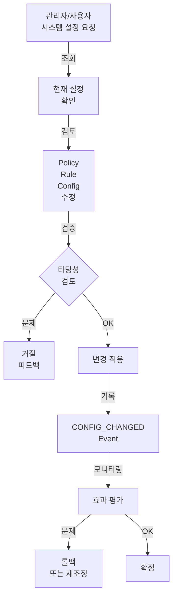
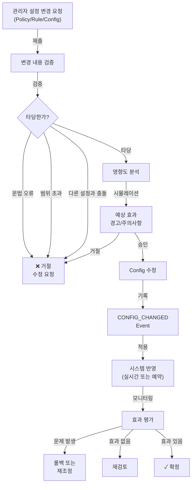

# 관리/설정 프로세스 (Administration & Configuration)

Policy, Rule, Config를 통한 시스템 운영 로직 관리  
**기반**: [ADR-006](../adr/ADR-006-adaptive-autonomy-migration-path.md) (코드 수정 없이 운영 조정)

**이 문서에서 준수하는 핵심 원칙**:
- [P6](../core/principles.md#p6-정책-기반-자동-대응-원칙-policy-based-autonomous-response) (정책 기반 자동 대응)
  - 정의된 Policy/Rule이 있는 상황 → 자동 대응 (코드 수정 X)
  - 정의된 Policy/Rule이 없는 상황 → 사용자 승인 필요
  - Policy 변경으로 자동화 수준을 Phase 1→2→3으로 점진적 상향
- [P10](../core/principles.md#p10-🔴-구현-세부-비노출-원칙-implementation-detail-abstraction) (정책은 설정으로, 코드 수정은 최소화)

---

## 프로세스 개요



---

## 5-1. AgentConnection 기준 관리

**Device Agent 간 협력 관계의 생성/유지 기준 설정**

### **관리 항목**:

```typescript
AgentConnectionPolicy {
  id: "policy-agent-connection",
  
  // 각 connection_type별 기준
  rules: [
    {
      connection_type: "RELAY",
      
      // 생성 조건
      creation_criteria: {
        distance_max_km: 50,        // 최대 거리
        signal_strength_min_dbm: -90, // 최소 신호 강도
        battery_min_percent: 40,    // Relay Agent 최소 배터리
        latency_max_ms: 2000        // 최대 통신 지연
      },
      
      // 유지 조건
      maintenance_criteria: {
        heartbeat_check_interval_sec: 10,
        degradation_threshold: {
          signal_strength_dbm: -95,  // 신호 악화 임계
          latency_ms: 3000,          // 지연 증가 임계
          packet_loss_percent: 10    // 패킷 손실 임계
        }
      },
      
      // 종료 조건
      termination_criteria: {
        consecutive_failures: 3,     // 연속 3회 실패 시 종료
        connection_duration_max_hours: 24, // 최대 유지 시간
        auto_refresh_interval_hours: 6   // 6시간마다 자동 재평가
      }
    },
    {
      connection_type: "COORDINATE",
      creation_criteria: {
        distance_max_km: 30,
        time_sync_error_max_ms: 100,
        cooperative_missions_enabled: true
      }
    }
  ]
}
```

### **설정 변경 절차**:

```
관리자가 RELAY 기준 변경 요청
  - distance_max_km: 50 → 30 (더 가까운 거리에서만 중계)
  ↓
System이 적용 전 검증
  ├─ 기존 AgentConnection 영향도 분석
  ├─ "현재 3개의 RELAY가 새 기준 위반" 경고
  └─ 승인 필요
  ↓
관리자 승인
  ↓
Config 수정
  ↓
이미 생성된 Connection:
  ├─ 범위 내? → 유지
  └─ 범위 외? → DEGRADED → 자동 종료 또는 재협상
  ↓
새 Connection 생성:
  └─ 새 기준 적용
  ↓
CONFIG_CHANGED Event 기록
```

---

## 5-2. 사용자 / 권한 관리

**시스템 사용자의 역할과 권한 정의**

### **사용자 역할**:

```typescript
User {
  id: "user-001",
  name: "박관리자",
  
  // 역할 정의
  role: "ADMIN" | "OPERATOR" | "VIEWER",
  
  status: "ACTIVE" | "DISABLED",
  
  // 권한 (역할별)
  permissions: {
    // ADMIN: 모든 권한
    ADMIN: [
      "user.create",
      "user.delete",
      "policy.edit",
      "rule.edit",
      "config.edit",
      "device.remove",
      "system.reboot"
    ],
    
    // OPERATOR: 운영 권한
    OPERATOR: [
      "mission.create",
      "mission.approve",
      "mission.cancel",
      "device.register",
      "report.view",
      "config.view"  // 읽기만
    ],
    
    // VIEWER: 조회만
    VIEWER: [
      "mission.view",
      "report.view",
      "device.view",
      "event.view"
    ]
  }
}
```

### **사용자 관리 절차**:

```
관리자가 새 사용자 추가/제거/권한 변경
  ↓
System: 권한 검증
  - 관리자가 정말 이 권한을 변경할 수 있는가?
  - 사용자가 현재 Mission 진행 중? → 변경 거부
  ↓
승인
  ↓
USER_MODIFIED Event 기록
  {
    type: "USER_MODIFIED",
    data: {
      user_id: "user-002",
      change: "role: OPERATOR → ADMIN",
      modified_by: "user-001"
    }
  }
  ↓
시스템 반영 (실시간)
  - 해당 사용자의 다음 작업부터 새 권한 적용
```

---

## 5-3. 시스템 설정 관리

**전체 시스템의 공통 파라미터 조정**

### **주요 설정값**:

```typescript
Config {
  // Heartbeat 및 타이머
  "device_heartbeat_interval_sec": {
    value: 10,
    description: "Device가 System에 보내는 Heartbeat 주기"
  },
  
  "device_offline_timeout_sec": {
    value: 600,  // 10분
    description: "이 시간 이상 Heartbeat 없으면 OFFLINE 판정"
  },
  
  // 배터리 관리
  "min_battery_percent_for_task": {
    value: 30,
    description: "새 Task 할당 최소 배터리 %"
  },
  
  "critical_battery_percent": {
    value: 10,
    description: "배터리 이 이하면 CRITICAL로 판정, 자동 복귀"
  },
  
  // Proposal 및 추천
  "max_proposal_options": {
    value: 3,
    description: "사용자에게 제시하는 최대 Proposal 개수"
  },
  
  "proposal_expiry_hours": {
    value: 24,
    description: "사용자가 선택하지 않은 Proposal 유효 시간"
  },
  
  // Task 타이머
  "task_timeout_sec": {
    value: 3600,  // 1시간
    description: "Task 실행 타임아웃"
  },
  
  // Report 생성
  "auto_report_enabled": {
    value: true,
    description: "Mission 완료 시 자동 Report 생성"
  },
  
  "report_detail_level": {
    value: "FULL",  // MINIMAL / MEDIUM / FULL
    description: "Report에 포함할 상세도"
  },
  
  // 기타
  "enable_auto_response": {
    value: true,
    description: "Critical 상황에서 자동 대응 허용"
  },
  
  "log_retention_days": {
    value: 90,
    description: "운영 로그 보관 기간"
  }
}
```

### **설정 변경 검증**:

```
관리자가 "device_offline_timeout_sec: 600 → 300" 변경 요청
  ↓
System이 검증
  ├─ 값의 범위 체크 (0 < 값 < 3600)
  ├─ 다른 설정과의 충돌 체크
  │  (offline_timeout < heartbeat_interval은 말이 안 됨)
  └─ 영향도 분석: "현재 온라인 Device 4개, offline 판정 시간 단축"
  ↓
경고 표시
  "Heartbeat 간격(10초)보다 짧은 타임아웃(5분)은 권장되지 않습니다.
   기존 온라인 Device 4개 중 일부가 OFFLINE으로 오판될 수 있습니다."
  ↓
관리자 승인 또는 취소
  ↓
적용 + Event 기록
```

---

## 5-4. 문제 감지 기준 관리

**어떤 상황을 "문제"로 판정할지 정의**

### **감지 기준**:

```typescript
DetectionPolicy {
  problems: [
    {
      id: "detect-low-battery",
      type: "PROBLEM_DETECTION",
      
      // 감지 조건
      condition: {
        field: "device.battery_percent",
        operator: "LT",
        value: 30
      },
      
      // 반응
      action: {
        create_event: {
          type: "LOW_BATTERY",
          severity: "WARNING"
        },
        create_proposal: true  // 사용자 선택 Proposal 생성
      },
      
      // 설정
      debounce_sec: 60,  // 1분 내 중복 Event 생성 X
      enabled: true
    },
    
    {
      id: "detect-device-offline",
      type: "PROBLEM_DETECTION",
      
      condition: {
        field: "device.last_heartbeat_age_sec",
        operator: "GT",
        value: 600  // 10분 이상
      },
      
      action: {
        create_event: {
          type: "DEVICE_OFFLINE",
          severity: "WARNING"
        }
      },
      
      check_interval_sec: 10,  // 10초마다 체크
      enabled: true
    },
    
    {
      id: "detect-connection-degraded",
      type: "PROBLEM_DETECTION",
      
      condition: {
        field: "agent_connection.signal_strength_dbm",
        operator: "LT",
        value: -95
      },
      
      action: {
        create_event: {
          type: "AGENTCONNECTION_DEGRADED",
          severity: "WARNING"
        }
      },
      
      enabled: true
    }
  ]
}
```

### **기준 변경 시나리오**:

```
운영자: "배터리 경고 기준을 30%에서 40%로 올려 주세요.
         현재 자주 경고가 뜸"
  ↓
관리자가 Config 변경 검토
  ├─ 현재: 30% 미만 경고
  └─ 변경: 40% 미만 경고
  ↓
영향도 분석
  - "지난 30일 battery < 40% 이벤트 23개"
  - "매일 평균 0.77개의 추가 경고 발생 예상"
  ↓
변경 적용
  ↓
이후 모니터링
  - 과도한 경고? 롤백
  - 적절함? 유지
```

---

## 5-5. 자동 대응 기준 관리

**어떤 상황에서 사용자 승인 없이 자동으로 대응할지 정의**

### **자동 대응 정책**:

```typescript
AutoResponsePolicy {
  rules: [
    {
      id: "auto-low-battery-return",
      
      trigger: "PROBLEM_DETECTED",
      condition: {
        event_type: "LOW_BATTERY",
        battery_percent: "LT 20"  // 20% 미만만
      },
      
      // 자동 실행
      auto_mission: {
        type: "RETURN",
        priority: "HIGH",
        reason: "Low battery auto-return"
      },
      
      // 활성화 여부
      enabled: true,
      
      // 예외 상황
      exceptions: [
        "mission_type == 'EMERGENCY'",  // 긴급 미션 중이면 X
        "current_location == 'base'"    // 이미 기지 근처면 X
      ]
    },
    
    {
      id: "auto-critical-hazard-stop",
      
      trigger: "CRITICAL_HAZARD Event",
      condition: {
        severity: "CRITICAL",
        hazard_type: ["collision_risk", "emergency_signal"]
      },
      
      auto_mission: {
        type: "EMERGENCY_STOP",
        priority: "EMERGENCY"
      },
      
      enabled: true,  // 항상 활성화 (비활성화 불가)
      
      // 모든 진행 중인 미션 중단
      preemption: true
    },
    
    {
      id: "auto-offline-device-replace",
      
      trigger: "DEVICE_OFFLINE Event",
      condition: {
        offline_duration_sec: "GT 300"  // 5분 이상
      },
      
      auto_action: {
        type: "CREATE_PROPOSAL",  // 자동 Mission X, 사용자 선택
        suggestion: "대체 Device로 재실행"
      },
      
      enabled: false  // 현재 비활성화, Phase 2에서 활성화 가능
    }
  ]
}
```

### **자동 대응 활성화/비활성화**:

```
관리자가 "auto-low-battery-return" 활성화 검토
  ↓
위험도 분석
  - "배터리 < 20%일 때 자동으로 기지 복귀"
  - "장점: 안전성 향상, 배터리 관리 자동화"
  - "위험: 사용자가 원하지 않는 시점 작업 중단"
  ↓
승인
  ↓
Policy 수정
  {
    id: "auto-low-battery-return",
    enabled: true  // false → true
  }
  ↓
다음 LOW_BATTERY Event부터 자동 RETURN Mission 생성
```

---

## 5-6. 작업 추천 기준 관리

**Proposal을 생성할 때 Device 추천 우선순위 정의**

### **추천 기준**:

```typescript
RecommendationPolicy {
  device_selection_priority: [
    {
      factor: "availability",
      weight: 40,  // 40%
      description: "Device가 현재 사용 가능한가?"
    },
    {
      factor: "battery",
      weight: 25,
      description: "배터리 충분한가? (충분할수록 높은 점수)"
    },
    {
      factor: "distance",
      weight: 20,
      description: "작업 위치에 가까운가? (가까울수록 높은 점수)"
    },
    {
      factor: "success_rate",
      weight: 15,
      description: "해당 Device의 과거 성공률 (높을수록 높은 점수)"
    }
  ],
  
  // 가중치 계산 예시
  scoring_formula: `
    final_score = (availability * 0.4) + 
                  (battery * 0.25) + 
                  (distance * 0.20) + 
                  (success_rate * 0.15)
    
    score >= 70 → 추천
    score 50-70 → 대체 옵션
    score < 50 → 제외
  `,
  
  // 추천 옵션 수
  max_recommendations: 3,
  
  // 추천 리스트 갱신
  update_interval_sec: 30  // 30초마다 재계산
}
```

### **추천 기준 변경**:

```
운영자: "최근 모든 작업이 거리가 먼 Device로 추천됨.
         distance 가중치를 줄여 주세요."
  ↓
분석
  - 현재: distance 가중치 20%
  - 제안: distance 가중치 10% (대신 availability 30%)
  ↓
변경 전 시뮬레이션
  - "같은 요청으로 다시 계산하면..."
  - "Proposal 순서 변경 예상: Device-A → Device-B 순서로"
  ↓
승인
  ↓
적용 + 모니터링
```

---

## 5-7. 승인 기준 관리

**어떤 Mission은 사용자 승인이 필수인지 정의**

### **승인 정책**:

```typescript
ApprovalPolicy {
  rules: [
    {
      id: "approval-high-priority",
      
      condition: {
        mission_priority: "HIGH" | "EMERGENCY"
      },
      
      requires_approval: true,
      description: "HIGH/EMERGENCY 우선순위는 항상 승인 필수"
    },
    
    {
      id: "approval-long-duration",
      
      condition: {
        estimated_duration_hours: "GT 4"
      },
      
      requires_approval: true,
      description: "예상 시간 4시간 이상은 승인 필수"
    },
    
    {
      id: "approval-unsafe-area",
      
      condition: {
        target_area: ["danger_zone_1", "restricted_area"]
      },
      
      requires_approval: true,
      description: "위험 구역 진입은 항상 승인 필수"
    },
    
    {
      id: "approval-normal-operation",
      
      condition: {
        mission_priority: ["LOW", "NORMAL"],
        estimated_duration_hours: "LTE 2",
        safe_area: true
      },
      
      requires_approval: false,
      description: "일상적 작업은 자동 승인 가능 (Phase 2+)"
    }
  ]
}
```

### **승인 정책 변경 - Phase 진화**:

```
현재 (Phase 1): 모든 Mission 사용자 승인 필수
  ├─ requires_approval: true
  └─ 안전성 최우선
  
Phase 2: 일부 자동화
  ├─ 일상적 작업 (LOW/NORMAL) → 자동 승인
  └─ 위험/긴급 → 여전히 필수
  
Phase 3: 신뢰 기반 자동화
  ├─ 사용자 신뢰도 기반 승인
  └─ "(user_trust_level > 3) ? auto : required"
```

---

## 설정 변경 워크플로우



---

## 참고

- **[ADR-006](../adr/ADR-006-adaptive-autonomy-migration-path.md)**: 정책 기반 자동화
- **[schema.md](../core/schema.md)**: Policy, Rule, Config 스키마
- **[reporting.md](reporting.md)**: 개선 후보 도출
- **[operation.md](operation.md)**: 운영 프로세스
- **[lifecycle.md](lifecycle.md)**: 생명주기
