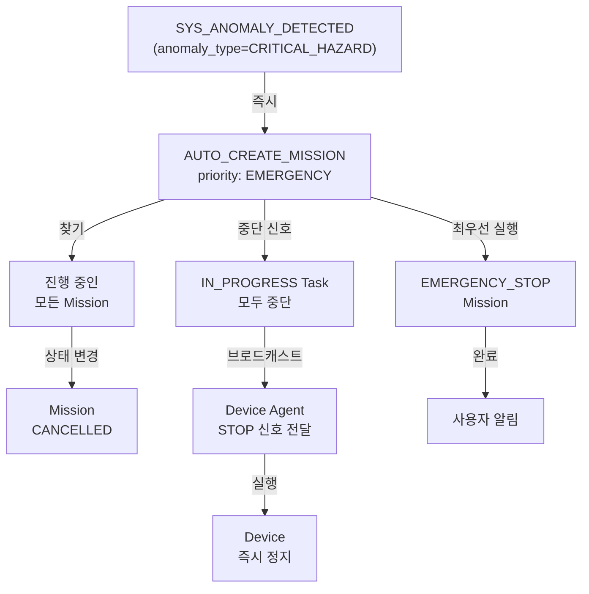

# 예외와 자동 대응

오류 상황과 시스템의 자동 대응 메커니즘  
**기반**: [ADR-003](../adr/ADR-003-capability-driven-task-assignment.md), [ADR-005](../adr/ADR-005-event-triggered-rule-execution.md), [ADR-006](../adr/ADR-006-adaptive-autonomy-migration-path.md)

**이 문서에서 준수하는 핵심 원칙**:

- [P5](../core/principles.md#p5-🔴-task-수행-가능성-최종-판단-원칙-final-task-feasibility-decision) (Device Agent의 거절 권한)
- [P6](../core/principles.md#p6-정책-기반-자동-대응-원칙-policy-based-autonomous-response) (정책 기반 자동 대응)
- [P7](../core/principles.md#p7-🔴-사용자-결정-우선-원칙-user-decision-priority) (사용자 최종 선택)
- [P9](../core/principles.md#p9-기록-가능성-원칙-traceability) (모든 예외 기록)

---

## 주요 예외 시나리오

### **1️⃣ SYS_INTENT_REJECTED: 요청 불가능**

**상황**: 사용자 요청을 수행할 수 있는 Device가 없거나 불가능

**P5 적용 (Capability-Driven Assignment)**:

- System은 Device.actions[]에 없는 작업은 절대 할당하지 않음 (Strict Capability Matching)
- Device의 현재 상태(OFFLINE, LOW_BATTERY 등)도 할당 조건 중 하나

**원인** (ADR-003):

- 필요한 `required_action`을 가진 Device가 없음
- Device는 있지만 OFFLINE/ERROR 상태
- Device는 있지만 배터리 부족
- 물리적 위치상 불가능 (범위 밖 등)

**시스템 대응** (명시적 거절):

```typescript
Event {
  type: "SYS_INTENT_REJECTED",
  severity: "WARNING",
  target_type: "SYSTEM",
  data: {
    original_request: "A 구역 바닥면을 고해상도로 촬영해줘",
    reason: "필요한 기능이 없거나 장비 상태 불가",
    required_actions: ["MOVE_TO", "HIGH_RES_SCAN"],
    capability_gap: {
      missing_action: "HIGH_RES_SCAN",
      available_devices: "ROV-1(OFFLINE), USV-1(SURFACE_SCAN만 가능)"
    }
  }
}
```

**사용자에게 전달**:

```
고해상도 촬영을 수행할 수 없습니다.

필요: HIGH_RES_SCAN 기능
현재 상황:
- ROV-1: HIGH_RES_SCAN 있음, 하지만 OFFLINE
- USV-1: SURFACE_SCAN만 가능

대안:
1. ROV-1이 온라인 될 때까지 대기
2. USV-1로 저해상도 촬영 수행
3. 고해상도 촬영 가능한 새 Device 추가
```

**복구**: 사용자 선택 또는 System 상태 변경 후 재요청

---

### **2️⃣ SYS_ANOMALY_DETECTED (anomaly_type=LOW_BATTERY): 배터리 부족**

**상황**: Device 배터리가 경고 임계값(`warning_battery_percent = 20%`)에 도달함

**P6 적용 (정책 기반 자동 대응)**:

- Policy가 정의된 경우: `battery < 10%` → 즉시 RETURN_TO_BASE Mission 자동 생성
- Policy가 없는 경우: `battery < 20%` 구간에서는 경고만 발행, 사용자 선택 대기

**감지**:

```
Heartbeat 데이터:
  device: ROV-1
  battery_percent: 15%

System Agent 판단:
  15% < 30% → 경고 임계값 초과 → Event 발행
```

**Event 발행**:

```typescript
Event {
  type: "SYS_ANOMALY_DETECTED",
  severity: "WARNING",
  target_type: "DEVICE",
  target_id: "rov-1",
  data: {
    anomaly_type: "LOW_BATTERY",
    battery_percent: 15,
    threshold: 30,
    delta: -15
  }
}
```

**Rule Engine 실행** (ADR-005):

```typescript
Rule {
  rule_type: "AUTO_RESPONSE",
  conditions: [
    { field: "event.type", operator: "EQ", value: "SYS_ANOMALY_DETECTED" },
    { field: "event.data.anomaly_type", operator: "EQ", value: "LOW_BATTERY" },
    { field: "device.battery_percent", operator: "LT", value: 10 }
  ],
  action: {
    type: "AUTO_CREATE_MISSION",
    params: { mission_type: "RETURN_TO_BASE", reason: "Low battery" }
  }
}
```

**자동 대응**:

1. 임계값 < 10% → 즉시 RETURN_TO_BASE Mission 생성 (사용자 승인 X)
2. 임계값 10-30% → 알림 Event만 발행, 사용자 선택 대기

**복구**:

1. Device가 자동으로 기지로 복귀
2. 충전 후 온라인 상태 복구
3. 배터리 100%일 때 다시 Mission 할당 가능

---

### **3️⃣ SYS_ANOMALY_DETECTED (anomaly_type=DEVICE_OFFLINE): Device 오프라인**

**상황**: Device Agent의 Heartbeat가 설정 시간(`device_offline_timeout_sec`)을 초과

**감지**:

```
마지막 Heartbeat: 2026-05-12 10:00:00
현재 시간: 2026-05-12 10:00:11
경과 시간: 11초 > 10초(timeout)

System Agent:
  Device.status: ONLINE → OFFLINE
  SYS_ANOMALY_DETECTED Event 발행 (`anomaly_type=DEVICE_OFFLINE`)
```

**Event 발행**:

```typescript
Event {
  type: "SYS_ANOMALY_DETECTED",
  severity: "WARNING",
  target_type: "DEVICE" | "AGENT",
  data: {
    anomaly_type: "DEVICE_OFFLINE",
    last_heartbeat_at: "2026-05-12T10:00:00Z",
    timeout_sec: 10
  }
}
```

**상황별 대응**:

**Case 1: Mission 진행 중 OFFLINE**

```
Task-1 IN_PROGRESS (Device: ROV-1)
  ↓
SYS_ANOMALY_DETECTED Event (`anomaly_type=DEVICE_OFFLINE`)
  ↓
Rule Engine:
  - Critical이면: 현재 Task FAILED → Mission FAILED
  - 일반이면: 재연결 기다림
  ↓
Device Agent (Edge-Side Resilience):
  - 할당받은 Task 계속 수행 (로컬 진행)
  - 재연결 시 System에 결과 보고
```

**Case 2: Mission 대기 중 OFFLINE**

```
Mission READY (Task 할당 안 됨)
  ↓
SYS_ANOMALY_DETECTED Event (`anomaly_type=DEVICE_OFFLINE`)
  ↓
Rule Engine:
  - 다른 Device로 Proposal 재생성
  - 또는 Device 복귀 대기
```

**복구**:

1. 네트워크 복구 → Heartbeat 재개
2. Device.status: OFFLINE → ONLINE
3. 다시 Task 할당 가능

---

### **4️⃣ SYS_TASK_FAILED (status=FAILED): Task 실행 실패**

**상황**: Device Agent가 Task 실패를 보고하거나 System이 Timeout 감지

**원인**:

- Device 하드웨어 오류
- 센서 오류
- 통신 오류
- 환경적 제약 (장애물 충돌, 깊이 초과 등)
- Timeout (작업이 너무 오래 걸림)

**Event 발행**:

```typescript
Event {
  type: "SYS_TASK_FAILED",
  severity: "WARNING",
  target_type: "TASK",
  target_id: "task-2",
  data: {
    status: "FAILED",
    mission_id: "mission-123",
    error_type: "HardwareError",
    error_message: "High Resolution Camera Hardware Failure",
    device_id: "rov-1",
    agent_id: "agent-rov-1"
  }
}
```

**Task 상태 변경**:

```typescript
Task {
  id: "task-2",
  status: "FAILED",
  status_reason: "High Resolution Camera Hardware Failure",
  status_updated_at: "2026-05-12T10:45:00Z"
}

// 남은 Task 자동 취소
Task-3 {
  status: "CANCELLED",
  status_reason: "Previous task failed",
  status_updated_at: "2026-05-12T10:45:05Z"
}
```

**Mission 상태 변경**:

```typescript
Mission {
  status: "FAILED",
  status_reason: "Task-2 실패로 인한 Mission 중단",
  status_updated_at: "2026-05-12T10:45:00Z"
}
```

**Rule Engine 실행**:

```typescript
Rule {
  rule_type: "AUTO_RESPONSE",
  conditions: [
    { field: "event.type", operator: "EQ", value: "SYS_TASK_FAILED" },
    { field: "event.data.status", operator: "EQ", value: "FAILED" },
    { field: "event.severity", operator: "EQ", value: "WARNING" }
  ],
  action: {
    type: "CREATE_PROPOSAL",  // 사용자가 선택하도록
    params: {
      mission_type: "RETRY_OR_ALTERNATIVE"
    }
  }
}
```

**사용자 선택지**:

1. **동일 조건 재시도**: Device 오류 해결 후 Task-2부터 재실행
2. **다른 Device로 재실행**: 다른 Device로 전체/부분 재시작
3. **재계획**: 새로운 상황에서 Proposal 재요청
4. **종료**: Mission 포기

**복구**: 사용자 선택에 따라 새로운 Mission 생성

---

### **4️⃣-2 SYS_TASK_FAILED (status=ABORTED): Device Agent가 Task 거절 (P5 적용)**

**상황**: Device Agent가 Task를 받은 후 실행 불가능하다고 판단해서 거절

**원인** (P5: Task 수행 가능성 최종 판단):

- 센서가 없거나 고장남 (required_action에 필요한 센서 부재)
- 배터리 부족으로 이 Task를 수행할 수 없음
- 물리적 위치/거리 초과
- 이미 다른 Mission에 할당되어 있음
- 안전 규칙 위반 (깊이 초과, 속도 제한 초과 등)

**Event 발행**:

```typescript
Event {
  type: "SYS_TASK_FAILED",
  severity: "WARNING",
  target_type: "TASK",
  data: {
    status: "ABORTED",
    task_id: "task-1",
    mission_id: "mission-123",
    device_id: "rov-1",
    agent_id: "agent-rov-1",
    abort_reason: "Required sensor CAMERA not found",
    abort_type: "SENSOR_MISSING | BATTERY_INSUFFICIENT | LOCATION_IMPOSSIBLE | SAFETY_VIOLATION | ALREADY_ASSIGNED"
  }
}
```

**Task 상태 변경** (schema.md 기준):

```typescript
// PENDING 또는 ASSIGNED 상태에서만 ABORTED 가능 (시작 전 판단)
Task {
  id: "task-1",
  status: "ABORTED",  // PENDING → ABORTED 또는 ASSIGNED → ABORTED
  status_reason: "Required sensor CAMERA not found",
  status_updated_at: "2026-05-12T10:31:05Z"
}

// Mission은 FAILED로 전이 (Task 수행 불가로 판단됨)
Mission {
  status: "FAILED",  // ← ABORTED = 실행 불가로 판단
  status_reason: "Task-1 ABORTED: Required sensor not found",
  status_updated_at: "2026-05-12T10:31:05Z"
}

// 이후 Task들은 자동 취소
Task-2: CANCELLED (status_reason: "Mission failed due to Task-1 ABORTED", status_updated_at: "...")
Task-3: CANCELLED (status_reason: "Mission failed due to Task-1 ABORTED", status_updated_at: "...")
```

**System의 대응**:

```typescript
Rule {
  rule_type: "AUTO_RESPONSE",
  conditions: [
    { field: "event.type", operator: "EQ", value: "SYS_TASK_FAILED" },
    { field: "event.data.status", operator: "EQ", value: "ABORTED" },
    { field: "event.severity", operator: "EQ", value: "WARNING" }
  ],
  action: {
    type: "CREATE_PROPOSAL",
    params: {
      reason: "원래 Device가 거절함. 다른 Device 제시",
      mission_type: "RETRY_WITH_ALTERNATIVE_DEVICE"
    }
  }
}
```

**사용자 선택지**:

1. **다른 Device로 할당**: 다른 Device가 이 Task 가능한가?
2. **새로운 Device 추가**: 필요한 센서/능력을 가진 새 Device 등록
3. **미션 수정**: Task 요청사항을 낮춤 (예: 고해상도 → 일반 해상도)
4. **미션 취소**: 포기

**P5 적용 (Device Agent의 최종 판단 존중)**:

- System은 Device Agent의 거절을 받아들이고, 대안을 제시
- Device Agent를 강제로 Task 할당 불가
- 단, 사용자는 P7을 통해 "이 Device에 이 Task를 강제 할당"하라고 override 가능 (그 후 실패 책임은 사용자)

**`SYS_TASK_FAILED(status=FAILED)` vs `SYS_TASK_FAILED(status=ABORTED)` 구분**:
| 상황 | 상태 | 이유 | 설명 |
|------|------|------|------|
| Task 시작 전 Device가 거절 | ABORTED | P5: 불가능 사전 판단 | Device는 이 Task를 못함 (센서 없음, 범위 초과 등) |
| Task 시작했으나 도중에 실패 | FAILED | 예측 불가능한 오류 | 센서 급격한 고장, 충돌, 통신 단절 등 |

**복구**: 사용자 선택에 따라 다른 Device로 새로운 Proposal 생성

---

### **5️⃣ SYS_ANOMALY_DETECTED (anomaly_type=CRITICAL_HAZARD): 긴급 상황**

**상황**: 즉시 대응이 필요한 위험 상황

**P6 적용 (정책 기반 - 예외)**:

- CRITICAL 심각도는 **정책 여부 상관없이 즉시 자동 대응** (사용자 승인 불필요)
- 이유: 생명/자산 위험이므로 빠른 대응이 생존 조건
- 대응 후 사용자에게 보고

**원인**:

- 충돌 위험 감지
- 위험 구역 접근
- 통신 두절 (긴급 상황)
- 하드웨어 critical failure
- 명령어 실행 불가

**Event 발행**:

```typescript
Event {
  type: "SYS_ANOMALY_DETECTED",
  severity: "CRITICAL",  // ← CRITICAL
  target_type: "DEVICE" | "MISSION",
  data: {
    anomaly_type: "CRITICAL_HAZARD",
    hazard_type: "collision_risk",
    description: "Obstacle detected at 5 meters, collision risk"
  }
}
```

**자동 대응** (사용자 승인 없이) - **강제 중단(Preemption) 모델**:

Rule Engine이 즉시 자동 Response Mission 생성:

```typescript
Rule {
  rule_type: "AUTO_RESPONSE",
  conditions: [
    { field: "event.severity", operator: "EQ", value: "CRITICAL" },
    { field: "policy.auto_response_enabled", operator: "EQ", value: true }
  ],
  action: {
    type: "AUTO_CREATE_MISSION",
    params: {
      mission_type: "EMERGENCY_STOP",
      priority: "EMERGENCY"  // ← 최우선순위
    }
  }
}
```

**즉시 실행 - 우선순위 선점**:



**상세 프로세스**:

1. `SYS_ANOMALY_DETECTED` Event 발생 (`anomaly_type=CRITICAL_HAZARD`)
2. System Agent가 즉시 AUTO_CREATE_MISSION 실행
3. **현재 진행 중인 모든 Mission을 CANCELLED 처리**
   ```typescript
   SELECT * FROM missions WHERE status = 'IN_PROGRESS'
   UPDATE missions SET status = 'CANCELLED',
           status_reason = 'Emergency preemption due to CRITICAL_HAZARD',
           status_updated_at = NOW()
   ```
4. **IN_PROGRESS와 PENDING 상태의 모든 Task를 중단**
   ```typescript
   UPDATE tasks SET status = 'CANCELLED',
           status_reason = 'Emergency preemption due to CRITICAL_HAZARD',
           status_updated_at = NOW()
   WHERE status IN ('PENDING', 'IN_PROGRESS')
   AND mission_id IN (위에서 CANCELLED된 mission_id들)
   ```
5. **모든 Device Agent에 STOP 브로드캐스트**
   - "현재 실행 중인 작업을 즉시 중단하고 안전 상태로 이동"
6. **EMERGENCY_STOP Mission 최우선 생성 및 실행**
   - priority = EMERGENCY (가장 높음)
   - 즉시 Device Agent에 전달 (Proposal 단계 건너뜀)
7. Device 즉시 정지 (충돌 회피, 긴급 복귀 등)

**이후 처리**:

1. EMERGENCY_STOP Mission 완료 (정지 확인)
2. 이전 Mission들은 CANCELLED 상태로 기록
3. 이전 Task들의 미완료 작업들은 감사 추적(Event)에 기록
4. 위험 요인 제거 후 사용자가 재계획/재시도 요청 가능

**복구**:

1. 위험 상황 해결
2. EMERGENCY_STOP Mission COMPLETED
3. 사용자가 재요청하면 새로운 Proposal 생성

---

### **6️⃣ SYS_ANOMALY_DETECTED (anomaly_type=AGENTCONNECTION_DEGRADED): 협력 관계 저하**

**상황**: Device Agent 간 협력(RELAY, COORDINATE 등)이 불안정

**원인**:

- 통신 지연 증가
- 패킷 손실률 증가
- 신호 강도 감소
- Relay Agent 배터리 부족

**Event 발행**:

```typescript
Event {
  type: "SYS_ANOMALY_DETECTED",
  severity: "WARNING",
  target_type: "AGENT_CONNECTION",
  target_id: "conn-relay-1",
  data: {
    anomaly_type: "AGENTCONNECTION_DEGRADED",
    connection_type: "RELAY",
    agent_a_id: "agent-rov-1",
    agent_b_id: "agent-usv-1",
    latency_ms: 5000,  // 정상: < 1000ms
    packet_loss_percent: 15  // 정상: < 5%
  }
}
```

**대응**:

1. AgentConnection은 유지 (`deleted_at = null`)
2. SystemSentinel이 `SYS_ANOMALY_DETECTED` Event와 Alert 생성 (`anomaly_type=AGENTCONNECTION_DEGRADED`)
3. 새로운 RELAY 경로 탐색 (다른 Relay Agent 사용)
4. 긴급이면 현재 Mission 중단

**복구**: 통신 상태 개선 또는 다른 경로 재설정

---

## 🔍 Alert Fingerprint와 Event 중복 방지

**문제**: 동일한 문제가 반복되면 Event와 Alert가 폭주합니다.

- 배터리 부족 경고가 계속 발생 → Alert 테이블 폭증
- 온-오프 반복 Device → `SYS_ANOMALY_DETECTED(anomaly_type=DEVICE_OFFLINE)` Event 무한 반복
- 같은 실패가 매 Heartbeat마다 → 사용자가 동일 알림 수십 개

**해결**: Alert Fingerprint와 Deduplication 규칙 (기존 SYSTEM_ARCHITECTURE.md 섹션 13 기반)

### **Alert Fingerprint 개념**

Alert는 **고유한 fingerprint**를 가집니다.

```typescript
Alert {
  id: "alert-123",

  // Fingerprint: 동일 문제 식별
  fingerprint: {
    affected_scope: "device",      // device, mission, agent, system
    target_id: "device-rov-1",     // 어떤 Device/Mission?
    alert_type: "LOW_BATTERY",     // 어떤 종류의 문제?
    cause: "battery_percent < 20", // 근본 원인
    time_window: "1h"              // 시간 윈도우 (1시간 내)
  },

  // 같은 fingerprint를 가진 Alert는 병합
  duplicate_count: 5,              // 이미 5번 발생했음
  first_occurred_at: "2026-05-12T10:00:00Z",
  last_occurred_at: "2026-05-12T10:15:00Z",

  severity: "WARNING",
  status: "ACTIVE"  // 또는 RESOLVED, ESCALATED
}
```

### **Deduplication 규칙**

**Rule 1: 동일 Fingerprint → 중복 생성 방지**

```typescript
ON Event received:
  fingerprint = hash(affected_scope, target_id, alert_type, cause)

  existing_alert = SELECT * FROM alerts
                   WHERE fingerprint = ?
                   AND status IN ('ACTIVE', 'ESCALATED')

  IF existing_alert EXISTS:
    // 중복 Alert 생성 X, 기존 Alert 갱신
    UPDATE alerts
      SET duplicate_count = duplicate_count + 1,
          last_occurred_at = NOW()
      WHERE id = existing_alert.id

    // Event는 여전히 기록 (이력)
    INSERT INTO events (event_data)

  ELSE:
    // 새로운 문제 → 새 Alert 생성
    INSERT INTO alerts (fingerprint, ...)
    INSERT INTO events (event_data)
```

**Rule 2: Severity 상승 → 기존 Alert 갱신 또는 Escalation**

```typescript
IF new_event.severity > existing_alert.severity:
  // 심각도가 높아지면 Alert 갱신
  UPDATE alerts
    SET severity = new_event.severity,
        status = 'ESCALATED',  // ← ACTIVE → ESCALATED
        escalated_at = NOW()
  WHERE id = existing_alert.id

  // 사용자에게 재알림
  NotifyUser(alert, "Alert escalated to " + severity)
```

**Rule 3: 추천 반복 억제 (Recommendation Suppression)**

```typescript
IF user_rejected_recommendation THEN:
  // 사용자가 거절한 동일 추천은 일정 시간 제시 X

  recommendation_suppression = {
    fingerprint: "user_rejected_proposal_123",
    suppress_until: NOW() + 1_hour,
    reason: "User manually rejected"
  }

  // 1시간 동안 같은 추천 X
  // 단, severity가 상승하거나 새로운 근거 생기면 다시 표시
```

### **실제 적용 예**

**Scenario: `SYS_ANOMALY_DETECTED(anomaly_type=LOW_BATTERY)` Event가 계속 발생**

```
Timeline:
10:00 - Battery 30% → Event #1 발행
        → Alert #1 생성 (fingerprint: "device/rov-1/LOW_BATTERY/battery<30")
        → Proposal: "경고: 배터리 부족, 계속 진행할까요?" 제시

10:01 - Battery 29% → Event #2 발행
        → Alert #1의 duplicate_count: 1 → 2
        → Alert #1 갱신, 새 Alert X
        → Proposal 재제시 X (사용자가 이미 본 것)

10:02 - User: "아직 탐사 중이니까 나중에 귀환해"
        → recommendation_suppression 기록
        → 1시간 동안 같은 Proposal X

10:15 - Battery 5% → Event #3 발행 (심각도 상승)
        → Alert #1의 severity: WARNING → CRITICAL 상향
        → Status: ACTIVE → ESCALATED
        → Proposal: "긴급 귀환 필수" 재제시 (우선순위 높음)
        → user_rejection 무시 (심각도 상승)
```

### **저장소 설계**

```typescript
// Alert 테이블
Table alerts {
  id: UUID,

  // Fingerprint
  fingerprint: string,  // hash value
  affected_scope: enum,
  target_id: string,
  alert_type: string,
  cause: string,

  // Deduplication
  duplicate_count: int,
  first_occurred_at: timestamp,
  last_occurred_at: timestamp,

  // Status
  severity: enum,
  status: enum ('ACTIVE', 'ESCALATED', 'RESOLVED'),
  escalated_at: timestamp,
  resolved_at: timestamp,

  // Related
  event_ids: string[],      // 관련 Event 목록
  recommendation_ids: string[],

  created_at: timestamp,
  updated_at: timestamp
}

// Recommendation Suppression 테이블
Table recommendation_suppressions {
  id: UUID,
  user_id: string,
  recommendation_fingerprint: string,
  suppress_until: timestamp,
  reason: string,
  created_at: timestamp
}
```

### **효과**

- ✅ Alert 폭주 방지
- ✅ 사용자는 **중복 알림 받지 않음**
- ✅ 심각도 상승 시만 **재알림**
- ✅ 모든 Event는 여전히 기록 (감사 추적)
- ✅ Fingerprint 기반이므로 **정책 변경으로 조정 가능**

**관련 ADR**: [ADR-005](../adr/ADR-005-event-triggered-rule-execution.md) (Event-Triggered), [ADR-006](../adr/ADR-006-adaptive-autonomy-migration-path.md) (자동화 정책)

---

## 자동 대응 정책 요약

| 예외 | 심각도 | 자동 여부 | 규칙 |
| --- | --- | --- | --- |
| `SYS_INTENT_REJECTED` | INFO | ✗ | 사용자에게 이유 전달 |
| `SYS_ANOMALY_DETECTED` (`LOW_BATTERY < 10%`) | WARNING | ✓ | RETURN_TO_BASE 자동 생성 |
| `SYS_ANOMALY_DETECTED` (`LOW_BATTERY 10-30%`) | INFO | ✗ | 알림만 전달 |
| `SYS_ANOMALY_DETECTED` (`DEVICE_OFFLINE`) | WARNING | ✗ | 재연결 대기 또는 재계획 |
| `SYS_TASK_COMPLETED` / `SYS_TASK_FAILED` | WARNING | ✗ | 결과 기록 및 필요 시 재시도/대체 Proposal 제시 |
| `SYS_ANOMALY_DETECTED` (`CRITICAL_HAZARD`) | CRITICAL | ✓ | EMERGENCY_STOP 자동 생성 |
| `SYS_ANOMALY_DETECTED` (`AGENTCONNECTION_DEGRADED`) | WARNING | ✗ | 대체 경로 탐색 |

---

## Rule 기반 정책 조정 (ADR-006)

**현재 (Phase 1)**:

- 자동 대응은 CRITICAL만
- 나머지는 사용자 선택

**미래 (Phase 2-3)**:

```typescript
// 관리자가 Rule 추가 (코드 수정 X)
Rule {
  rule_type: "AUTO_RESPONSE",
  conditions: [
      { field: "event.type", operator: "EQ", value: "SYS_TASK_FAILED" },
    { field: "event.data.status", operator: "EQ", value: "FAILED" },
    { field: "policy.auto_retry_enabled", operator: "EQ", value: true }
  ],
  action: {
    type: "AUTO_CREATE_MISSION",
    params: { retry_count: 1 }
  },
  enabled: true  // 관리자가 on/off 제어
}
```

---

## 참고

- **[ADR-003](../adr/ADR-003-capability-driven-task-assignment.md)**: Fail-Fast & 명시적 거절
- **[ADR-005](../adr/ADR-005-event-triggered-rule-execution.md)**: Event-Triggered Rule
- **[ADR-006](../adr/ADR-006-adaptive-autonomy-migration-path.md)**: 자동화 수준 조절
- **[schema.md](../core/schema.md)**: Event, Rule, Config 스키마
- **[operation.md](operation.md)**: 작업 프로세스
- **[lifecycle.md](lifecycle.md)**: 미션 생명주기
