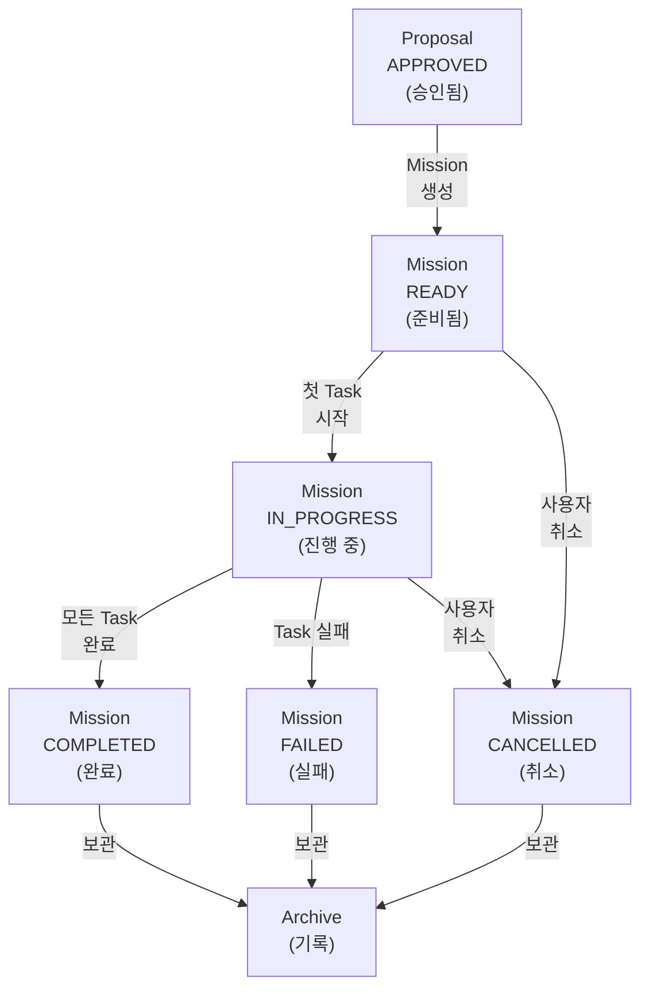
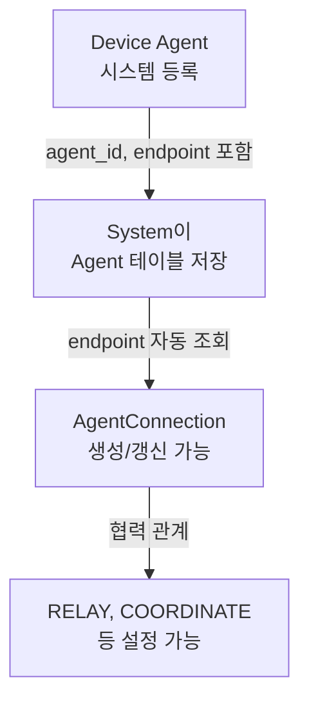

# 미션 생명주기 (Mission Lifecycle)

Proposal 승인부터 완료/취소까지의 전체 상태 전이  
**기반**: [ADR-002](../adr/ADR-002-proposal-as-solution-set.md), [ADR-004](../adr/ADR-004-agent-endpoint-management.md)

---

## 상태 다이어그램



---

## Device Agent 등록 (Prerequisites)

Mission이 생성되기 전, Device Agent가 먼저 등록되어야 합니다.

**준수 원칙**: [P1](../core/principles.md#p1-🔴-agent-직접-제어-원칙-agent-direct-control) (Agent 직접 제어)



**변경 (ADR-004)**:
- Agent 등록 시 `endpoint` 정보 필수
- AgentConnection이 이를 기반으로 profile 자동 구성

**P1 적용**: 각 Device Agent는 자신의 등록 정보(endpoint, actions[], status)를 관리하며, 다른 Agent을 직접 제어하지 않습니다. AgentConnection은 협력 관계만 정의할 뿐 실제 통신 중계는 해당 Agent이 수행합니다.

---

## Device Agent 등록 해제 & Device 제거

Device를 시스템에서 완전히 제거하는 프로세스입니다.

**준수 원칙**: [P1](../core/principles.md#p1-🔴-agent-직접-제어-원칙-agent-direct-control) (각 Agent의 협력 관계 재정의)

### **Prerequisites: Device 제거 조건**

```
Device 제거 전 확인:

1. Device 상태
   ├─ OFFLINE이어야 함 (온라인 상태면 제거 거부)
   └─ 이유: 온라인 상태 Device는 여전히 작업 수행 가능성

2. Device Agent의 AgentConnection
   ├─ RELAY로 참여 중? (다른 장비들이 이 Device를 중계 지점으로 사용?)
   ├─ COORDINATOR로 참여? (협력 관계 종료 가능한가?)
   └─ 대체 Agent 있는가? (중계 기능을 다른 Agent가 대신할 수 있는가?)

3. 현재 작업
   ├─ IN_PROGRESS Task? (제거 전 완료 또는 취소)
   └─ READY/QUEUED Mission? (할당 전 취소)
```

### **제거 흐름**

```mermaid
graph TD
    A["사용자: Device 제거 요청"] -->|POST /devices/{id}/remove| B["System 검증"]
    B -->|확인| C{"Device<br/>상태?"}
    C -->|ONLINE/ERROR| D["❌ 제거 거부<br/>먼저 OFFLINE 대기"]
    C -->|OFFLINE| E["AgentConnection<br/>확인"]
    E -->|조회| F{"협력 관계<br/>있는가?"}
    F -->|없음| G["제거 가능<br/>상태 확인"]
    F -->|있음| H{"대체 Agent<br/>있는가?"}
    H -->|없음| I["❌ 제거 거부<br/>협력 관계 유지 필요"]
    H -->|있음| J["기존<br/>AgentConnection<br/>REMOVED/EXPIRED<br/>처리"]
    J -->|새로 생성| K["새 AgentConnection<br/>대체 Agent로"]
    K -->|완료| G
    G -->|최종 확인| L["Device, Agent,<br/>Sensor 제거 처리"]
    L -->|상태 변경| M["removed_at<br/>타임스탬프 기록"]
    M -->|Event 발행| N["DEVICE_REMOVED<br/>Event"]
    N -->|보관| O["Archive<br/>감사 추적"]
```

### **단계별 상세**

#### **Step 1: Device 상태 확인**
```typescript
Device {
  id: "device-rov-1",
  status: "OFFLINE"  // ← OFFLINE 필수
}

// ONLINE/ERROR이면 제거 거부
if (device.status !== 'OFFLINE') {
  throw new Error("Can only remove OFFLINE devices")
}
```

#### **Step 2: AgentConnection 확인**
```typescript
// 해당 Device의 Agent가 참여한 모든 Connection 조회
SELECT * FROM agent_connections 
WHERE agent_a_id = '{device_agent_id}' 
   OR agent_b_id = '{device_agent_id}'
AND status != 'REMOVED'
```

**경우 1: AgentConnection이 없음**
```
→ 제거 가능 (Step 3으로)
```

**경우 2: AgentConnection이 있음**
```
예: RELAY 타입, ROV-1이 USV-1을 통해 System과 통신

현재 구조:
  System ← USV-1 (Relay Agent) ← ROV-1
  
해결:
  a) 대체 Agent가 있는가? (다른 선박이 Relay 가능?)
  b) 없으면 제거 거부 (협력 관계 유지 필수)
  c) 있으면 기존 Connection REMOVED 처리, 새 Connection 생성
```

#### **Step 3: 현재 작업 확인**
```typescript
// Device에 할당된 Task 확인
SELECT * FROM tasks 
WHERE assigned_device_id = '{device_id}'
AND status IN ('PENDING', 'ASSIGNED', 'IN_PROGRESS')

if (count > 0) {
  // Task 취소 처리
  UPDATE tasks SET status = 'CANCELLED',
         cancel_reason = 'Device removed'
  
  // Mission도 CANCELLED 처리 (모든 Task가 취소되면)
  UPDATE missions SET status = 'CANCELLED'
  WHERE id IN (위의 tasks의 mission_id들)
}
```

#### **Step 4: 제거 처리**
```typescript
// Device 상태 변경 (완전 삭제 X, removed_at 기록)
UPDATE devices SET status = 'REMOVED',
       removed_at = NOW()
WHERE id = '{device_id}'

// Agent도 REMOVED 처리
UPDATE agents SET removed_at = NOW()
WHERE id = '{device_agent_id}'

// Sensor도 REMOVED 처리
UPDATE sensors SET removed_at = NOW()
WHERE device_id = '{device_id}'

// AgentConnection REMOVED/EXPIRED 처리
UPDATE agent_connections SET status = 'REMOVED',
       expires_at = NOW()
WHERE (agent_a_id = '{device_agent_id}' 
    OR agent_b_id = '{device_agent_id}')
AND status != 'REMOVED'
```

#### **Step 5: Event 기록**
```typescript
Event {
  type: "DEVICE_REMOVED",
  severity: "INFO",
  target_type: "DEVICE",
  target_id: "device-rov-1",
  data: {
    device_name: "ROV-1",
    device_type: "ROV",
    removal_reason: "User requested",
    last_status: "OFFLINE",
    agent_connections_affected: 0 // 또는 영향받은 개수
  }
}
```

### **제거 후 상태**

```typescript
// 제거 완료 후
Device {
  id: "device-rov-1",
  status: "REMOVED",
  removed_at: "2026-05-12T15:30:00Z",
  // 다른 필드는 유지 (감사 추적용)
}

// 조회 시
SELECT * FROM devices WHERE status != 'REMOVED'  ← 활성 Device만 조회
SELECT * FROM devices                            ← 모든 Device (아카이브 포함)
```

### **복구 불가능성**

```
⚠️ 주의: Device 제거는 거의 되돌릴 수 없습니다.

되돌리려면:
1. 새 Device로 다시 등록 (새로운 device_id)
2. 기존 device_id는 REMOVED 상태로 유지 (감사 추적)
3. 이전 Mission들은 "사용 불가 Device" 기록으로 남음

따라서 제거 전 신중하게 검토해야 합니다.
```

---

## 단계별 상세 (Mission 생명주기)

**이 섹션에서 준수하는 핵심 원칙**:
- [P5](../core/principles.md#p5-🔴-task-수행-가능성-최종-판단-원칙-final-task-feasibility-decision): Task 수행 판단은 Device Agent가 최종 결정
- [P7](../core/principles.md#p7-🔴-사용자-결정-우선-원칙-user-decision-priority): 사용자의 선택과 override 권한
- [P10](../core/principles.md#p10-🔴-구현-세부-비노출-원칙-implementation-detail-abstraction): Task 레벨까지만 다룸

### **1️⃣ READY (준비됨)**

**시점**: Proposal 선택 → 사용자 승인 → 상태 재검증 ✓

**상태**:
```typescript
Mission {
  status: "READY",
  approved_by_user_id: "user-001",
  approved_at: "2026-05-12T10:30:00Z",
  started_at: null  // 아직 실행 시작 X
}
```

**의미**:
- Proposal의 "APPROVED" = 사용자가 이 안을 선택/승인함
- Mission의 "READY" = 시스템이 실행 준비를 완료함 (첫 명령을 어떤 Device에 전달할 준비가 됨)

**액션**:
- Mission 생성
- ProposalTask → Task 일괄 변환
- Task status: PENDING으로 초기화 (아직 Device에 전달 X)
- 모든 Task가 "실행 대기" 상태로 준비됨

**다음**:
- 첫 Task를 Device Agent에 전달 → Task: ASSIGNED → IN_PROGRESS
- Mission도 동시에 IN_PROGRESS로 전이
- 사용자가 취소 → CANCELLED로 전이

**Task 상태**:
```
Task-1: PENDING   ← Device에 아직 전달 안 됨
Task-2: PENDING   ← 아직 준비만 된 상태
Task-3: PENDING   ← 실행할 차례 아직 아님
```

---

### **2️⃣ IN_PROGRESS (진행 중)**

**시점**: 첫 Task가 Device Agent에서 실행 시작

**상태**:
```typescript
Mission {
  status: "IN_PROGRESS",
  started_at: "2026-05-12T10:31:00Z"  // Mission 시작 시각
}

Task-1 {
  status: "IN_PROGRESS",
  started_at: "2026-05-12T10:31:00Z"
}
```

**액션**:
- Device Agent가 Task-1 수행 중
- System Agent가 진행 상황 모니터링
- Heartbeat를 통해 Device 상태 추적

**P5 적용 (Device Agent의 최종 판단)**:
- Device Agent는 Task 수행 중 문제 발생 시 즉시 중단 가능
- "배터리 부족", "장애물 충돌", "센서 오류" 등을 이유로 Task FAILED 보고 가능
- System Agent는 Device Agent의 판단을 존중하고 대체안 제시 (거절 불가)

**Device/Agent 문제 발생 시**:
- OFFLINE, LOW_BATTERY 등의 Event 발행
- Rule Engine이 자동 대응 결정

**다음**:
- Task 완료 → 다음 Task 시작
- Task 실패 → FAILED로 전이
- 사용자 취소 → CANCELLED로 전이

---

### **3️⃣ COMPLETED (완료)**

**시점**: 모든 Task가 COMPLETED 상태

**상태**:
```typescript
Mission {
  status: "COMPLETED",
  completed_at: "2026-05-12T11:15:00Z",
  result_summary: "A 구역 고해상도 촬영 완료, 1200장 이미지 획득"
}

// 모든 Task가 완료 상태
Task-1: COMPLETED (completed_at: ...)
Task-2: COMPLETED
Task-3: COMPLETED
```

**액션**:
- Mission 결과 요약 저장
- Report 생성
- Event 발행: MISSION_COMPLETED

**다음**:
- Report 조회 가능
- 사용자가 새로운 요청 가능
- 기록 보관 → Archive

---

### **4️⃣ FAILED (실패)**

**시점**: Task 실행 중 실패 (Timeout, Error, Device 오류 등)

**상태**:
```typescript
Mission {
  status: "FAILED",
  fail_reason: "Task-2 (고해상도 촬영) Device 오류로 실패",
  completed_at: "2026-05-12T10:45:00Z"  // 실패 시각
}

Task-1: COMPLETED
Task-2: FAILED
  error_message: "High Resolution Camera Error: Device Hardware Failure"
Task-3: CANCELLED  // 남은 Task 자동 취소
```

**액션**:
- 현재 Task 중단
- 남은 Task 모두 CANCELLED
- TASK_FAILED 또는 MISSION_FAILED Event 발행
- Rule Engine이 자동 대응 결정 (재시도, 다른 Device로 재실행 등)

**P7 적용 (사용자 결정 우선)**:

사용자 선택지:
1. **동일 조건 재시도**: ROV-1 오류 해결 후 Task-2부터 재실행
2. **다른 Device로 재실행**: 다른 Device (AUV)로 전체 미션 재실행
3. **재계획**: 환경 변경된 상태에서 새로운 Proposal 요청
4. **종료**: Mission 포기

> System Agent는 실패 원인과 각 선택의 영향을 명확히 제시하되, 최종 결정은 사용자에게 맡깁니다.
> Device Agent의 거절 사유(오류, 배터리, 위치 등)는 우선순위 영향, 사용자의 override 결정을 존중합니다.

**다음**:
- 선택에 따라 새로운 Mission 생성 (재시도) 또는 종료
- 기록 보관 → Archive

---

### **5️⃣ CANCELLED (취소)**

**시점**: 사용자가 수동 취소 또는 Critical 상황으로 인한 자동 취소

**P7 적용 (사용자 결정 우선)**:
- 사용자가 명시적으로 취소 요청 가능
- 이유: 날씨 악화, 상황 변화, 우선순위 변경 등

**상태**:
```typescript
Mission {
  status: "CANCELLED",
  cancelled_at: "2026-05-12T10:40:00Z",
  cancel_reason: "사용자 요청: 날씨 악화로 미션 중단"
}

Task-1: COMPLETED
Task-2: CANCELLED
  cancel_reason: "Mission cancelled by user"
Task-3: CANCELLED
```

**액션**:
- 실행 중인 Task 중단 신호 전달
- Device Agent가 Device에 STOP 커맨드 전송
- 모든 남은 Task를 CANCELLED로 변경
- MISSION_CANCELLED Event 발행

**다음**:
- 필요 시 사용자가 다시 요청 (새로운 Proposal)
- 기록 보관 → Archive

---

## Archive (기록 보관)

**시점**: Mission이 COMPLETED, FAILED, CANCELLED 상태로 종료 후

**처리**:
- 활성 Mission에서 제거
- 이력 데이터베이스에 보관
- Report와 함께 사용자 조회 가능

**유지 목적**:
- 감사 추적 (Audit Trail)
- 분석 및 학습 (실패 원인, 개선 사항)
- 규정 준수 (Compliance)

---

## Task 상태 흐름 상세

```
Task 생성 (Proposal → Mission)
  ↓
PENDING (Task 대기)
  ├─ 할당되기 기다리는 상태
  └─ 다음: Device Agent에 전달 시 ASSIGNED
  
ASSIGNED (Task 할당됨)
  ├─ Device Agent가 Task 수신함
  └─ 다음: Device가 실행 시작 시 IN_PROGRESS
  
IN_PROGRESS (Task 진행 중)
  ├─ Device에서 실제 작업 중
  └─ 다음: 완료/실패/취소
  
COMPLETED (Task 완료)
  ├─ 작업 성공, result 저장
  └─ 다음: 다음 Task 시작 또는 Mission 완료
  
FAILED (Task 실패)
  ├─ 작업 오류, error_message 저장
  └─ 다음: Mission FAILED 또는 재시도
  
CANCELLED (Task 취소)
  ├─ Mission 취소 또는 Task 건너뜀
  └─ 다음: Mission 상태 결정
```

---

## Edge Case: Device 상태 변경 중 Mission 실행

**시나리오**: Mission 진행 중 Device가 OFFLINE 또는 배터리 부족

```
Task-1 실행 중 (Device: ONLINE, battery: 80%)
  ↓
Heartbeat: Device OFFLINE (network 끊김)
  ↓
System: LOW_CONNECTION Event 발행
  ↓
Rule Engine: 상황별 판단
  ├─ Critical이면: EMERGENCY_ABORT 신호
  ├─ 재시도 가능하면: 자동 재연결 시도
  └─ Relay 가능하면: AgentConnection으로 우회
  ↓
Device Agent (Edge-Side Resilience): 
  ├─ 현재 Task 계속 수행 (할당받은 Task 완료 목표)
  └─ 재연결 시 System에 결과 보고
```

---

## 🔌 통신 복구 & 상태 동기화 (Communication Recovery & State Sync)

**기반**: 기존 SYSTEM_ARCHITECTURE.md 섹션 16 (통신 두절 및 복구 규칙)

**준수 원칙**: 
- [P1](../core/principles.md#p1-🔴-agent-직접-제어-원칙-agent-direct-control) (Device Agent의 로컬 자율성)
- [P2](../core/principles.md#p2-책임-경계-명확화-원칙-clear-responsibility-boundary) (각 Agent의 1차 책임)
- [P3](../core/principles.md#p3-보고-기반-운영-원칙-report-based-operation) (Device 보고 정보의 신뢰)

### **상황**

**Phase 1: 통신 두절 감지**
```
Device Agent: 정상 실행
  ↓
Network Partition 발생
  ↓
Device: System과 통신 불가능
System: Heartbeat 타임아웃 감지 → HEARTBEAT_LOST Event
```

**Phase 2: 로컬 자율 운영 (Edge-Side Resilience)**
```
Device Agent는 전 버스:
  ├─ 할당받은 Task 계속 수행 (네트워크 단절 상관 X)
  ├─ 로컬 상태 변화 기록
  ├─ 센서 데이터 로컬 저장
  └─ Failsafe 정책 적용 (배터리 부족 시 귀환 등)

System Agent는 전시:
  ├─ Device 상태: OFFLINE으로 변경
  ├─ Mission 상태: 선택적 중단
  └─ 신규 Task 할당 X (복구 대기)
```

**Phase 3: 통신 복구**
```
Network 복구
  ↓
Device Agent: 재연결 → 시스템에 등록 정보 재전송
```

### **복구 프로세스 (상세)**

#### **Step 1: 통신 복구 감지**

```typescript
// Device Agent 관점
Device Agent {
  // 네트워크 복구 감지
  reconnect_event = await socket.reconnect()
  
  // System에 즉시 상태 보고
  message = {
    type: "RECONNECT",
    device_id: "device-rov-1",
    agent_id: "agent-rov-1",
    
    // ✅ 복구 시 보고할 핵심 정보
    offline_period: {
      disconnected_at: "2026-05-12T10:00:00Z",
      reconnected_at: "2026-05-12T10:15:00Z"
    },
    
    // 로컬 상태 요약
    local_state: {
      battery_percent: 45,
      location: { x: 123.4, y: 567.8, z: -50 },
      position_confidence: "high"
    },
    
    // 수행한 작업 결과들
    completed_tasks: [
      {
        task_id: "task-1",
        status: "COMPLETED",
        result: { ... },
        completed_at: "2026-05-12T10:05:00Z"
      },
      {
        task_id: "task-2",
        status: "COMPLETED",
        result: { ... },
        completed_at: "2026-05-12T10:10:00Z"
      }
    ],
    
    // 진행 중이던 작업
    in_progress_task: {
      task_id: "task-3",
      status: "IN_PROGRESS",
      progress_percent: 75
    },
    
    // 로컬에서 발생한 모든 Event
    local_events: [
      { type: "TASK_COMPLETED", task_id: "task-1", ... },
      { type: "TASK_COMPLETED", task_id: "task-2", ... },
      { type: "LOW_BATTERY_WARNING", battery_percent: 45, ... }
    ]
  }
  
  send_to_system(message)
}
```

#### **Step 2: System 상태 동기화**

```typescript
// System Agent 관점
ON device_reconnect_message_received:

  // 1단계: Device 상태 갱신
  device.status = "ONLINE"
  device.last_heartbeat = NOW()
  device.location = message.local_state.location
  device.battery_percent = message.local_state.battery_percent
  
  // 2단계: Task 결과 반영 (중요!)
  for task in message.completed_tasks:
    task_in_registry = registry.find_task(task.task_id)
    
    IF task_in_registry.status == "IN_PROGRESS":
      // Device가 성공했으므로 Task 완료 처리
      task_in_registry.status = "COMPLETED"
      task_in_registry.result = task.result
      task_in_registry.completed_at = task.completed_at
      
      // Mission 상태 갱신 (모든 Task가 완료됐나?)
      update_mission_status(task_in_registry.mission_id)
  
  // 3단계: 진행 중인 Task 확인
  IF message.in_progress_task EXISTS:
    in_progress = registry.find_task(message.in_progress_task.task_id)
    IF in_progress.status == "IN_PROGRESS":
      // Device가 진행 중 → 계속 진행 대기
      in_progress.progress_percent = message.in_progress_task.progress_percent
  
  // 4단계: Event 기록 (감사 추적)
  for event in message.local_events:
    INSERT INTO events (event)
    
    // 중요: Event가 발생한 시간순 정렬
    sort_events_by_timestamp()
  
  // 5단계: 새로운 Task 할당 가능 여부 확인
  IF device.status == "ONLINE" AND device.battery_percent >= min_battery:
    // 다시 Task 할당 가능
    can_assign_new_tasks = true
  ELSE:
    can_assign_new_tasks = false
```

#### **Step 3: Mission 상태 최종 확정**

```typescript
// 모든 Task 상태 확인 후 Mission 상태 결정
for mission in affected_missions:
  
  task_statuses = [task.status for task in mission.tasks]
  
  IF all(status == "COMPLETED"):
    mission.status = "COMPLETED"
    mission.completed_at = MAX(task.completed_at)
  
  ELSE IF any(status == "FAILED"):
    mission.status = "FAILED"
    // 사용자에게 선택지 제시
    notify_user("Task failed, retry?")
  
  ELSE IF any(status == "IN_PROGRESS"):
    mission.status = "IN_PROGRESS"
    // Device가 계속 진행 중
  
  ELSE IF all(status == "CANCELLED"):
    mission.status = "CANCELLED"
```

#### **Step 4: 사용자 알림**

```typescript
// 사용자에게 복구 요약 제시
notification = {
  title: "Device 재연결 완료",
  device_id: "device-rov-1",
  offline_duration: "15분",
  
  // 로컬에서 완료한 작업
  completed_during_offline: [
    "Task-1: A 구역 스캔 ✓",
    "Task-2: 표본 수집 ✓"
  ],
  
  // 현재 진행 상황
  current_status: "Task-3 진행 중 (75%)",
  
  // 필요 시 사용자 선택
  next_action: [
    "계속 진행",
    "미션 중단",
    "새로운 미션"
  ]
}

send_notification_to_user(notification)
```

### **핵심 규칙 (기존 SYSTEM_ARCHITECTURE.md 섹션 16)**

**Rule 1: Device Agent는 네트워크 단절 중에도 Task 계속 수행**
- 한 번 할당받은 Task는 반드시 완료하려고 노력
- 로컬 안전 정책 적용 (배터리 부족, 위험 감지 시)
- 로컬 상태와 작업 결과 모두 기록

**Rule 2: 통신 복구 후 Device가 보고한 정보가 canonical source**
```
IF registry_state != device_local_state:
  // Device가 더 최신 정보
  registry_state = device_local_state
  
  // 단, timestamp 기반 최신성 확인
  IF device_event.timestamp > registry_event.timestamp:
    ACCEPT device_event
  ELSE:
    CHECK_CONFLICT (두 상태가 모순?!)
```

**Rule 3: 동기화 완료 전까지 신규 Task 할당 금지**
```
IF device.status == "SYNCING":
  // 동기화 진행 중
  DO_NOT_assign_new_tasks()
ELSE IF device.status == "ONLINE":
  // 동기화 완료
  CAN_assign_new_tasks()
```

**Rule 4: 통신 복구 전에 발생한 이벤트는 모두 기록**
- 시간순 정렬
- Mission Timeline에 명시적으로 표시
- "오프라인 상태에서 발생" 별도 마킹

### **타이밍 문제 (엣지 케이스)**

**Case 1: Task가 거의 완료되었는데 통신 단절**
```
Device: Task 99% 완료, 마지막 결과 저장 중
Network: 끊김
System: Task "IN_PROGRESS" 상태로 기록 (완료 신호 못 받음)

→ 복구 후:
Device: "Task COMPLETED" 보고
System: "아, Task 완료였구나" → 상태 갱신
```

**Case 2: 복구 후 메시지 유실**
```
Device: 복구 메시지 전송 (Task 완료 정보 포함)
Network: 메시지 일부 유실
System: 불완전한 정보 수신

→ 재시도 메커니즘:
Device: Ack 못 받으면 주기적 재전송
System: Idempotency 보장 (task_id 기반)
```

### **저장소 설계**

```typescript
// Mission Timeline에 추가 정보 기록
Table mission_timeline {
  id: UUID,
  mission_id: string,
  
  event_type: enum,  // TASK_COMPLETED, OFFLINE, RECONNECTED 등
  occurred_at: timestamp,
  recorded_at: timestamp,
  
  // 오프라인 상태 마킹
  device_was_offline: boolean,
  
  // 메타 정보
  source: enum ('device', 'system'),  // 어디서 온 정보?
  
  created_at: timestamp
}

// Device 상태 이력
Table device_state_snapshots {
  id: UUID,
  device_id: string,
  
  // 스냅샷 시점
  timestamp: timestamp,
  event_type: enum,  // OFFLINE, RECONNECT, STATUS_CHANGE
  
  // 상태
  status: enum,
  battery_percent: int,
  location: point,
  
  created_at: timestamp
}
```

### **효과**

- ✅ 통신 단절 상황에서 Device 자율성 확보
- ✅ 오프라인 중 수행 작업 손실 방지
- ✅ 복구 후 정확한 상태 동기화
- ✅ 모든 이벤트 기록 (감사 추적)
- ✅ Mission 재실행/재계획 전에 정확한 현황 파악

---

## 참고

- **[ADR-002](../adr/ADR-002-proposal-as-solution-set.md)**: Proposal → Mission 변환
- **[ADR-004](../adr/ADR-004-agent-endpoint-management.md)**: Agent 등록 및 AgentConnection
- **[domain-model.md](../core/domain-model.md)**: Mission/Task 정의
- **[schema.md](../core/schema.md)**: Mission/Task 스키마
- **[operation.md](operation.md)**: 작업 프로세스
- **[exceptions.md](exceptions.md)**: 실패 및 대응
