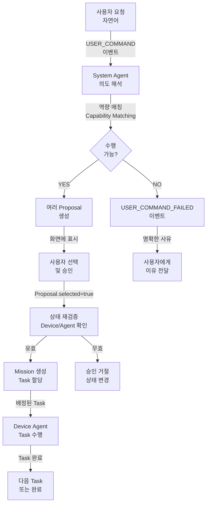

# 작업 프로세스 (Operation Process)

작업 제안 → 사용자 선택 → 실행의 전체 흐름  
**기반**: [ADR-002](../adr/ADR-002-proposal-as-solution-set.md), [ADR-003](../adr/ADR-003-capability-driven-task-assignment.md), [ADR-005](../adr/ADR-005-event-triggered-rule-execution.md)

**이 문서에서 준수하는 핵심 원칙**:
- [P1](../core/principles.md#p1-🔴-agent-직접-제어-원칙-agent-direct-control) (각 Agent의 자원만 제어)
- [P3](../core/principles.md#p3-보고-기반-운영-원칙-report-based-operation) (Device 보고 정보 신뢰)
- [P4](../core/principles.md#p4-mission-중심-운영-원칙-mission-centric-operation) (Mission 중심 운영)
- [P5](../core/principles.md#p5-🔴-task-수행-가능성-최종-판단-원칙-final-task-feasibility-decision) (Device Agent의 최종 판단)
- [P7](../core/principles.md#p7-🔴-사용자-결정-우선-원칙-user-decision-priority) (사용자 우선)
- [P10](../core/principles.md#p10-🔴-구현-세부-비노출-원칙-implementation-detail-abstraction) (Task 레벨까지만)

---

## 프로세스 플로우 (High Level)



---

## 단계별 상세 흐름

### **1️⃣ 사용자 요청 수신**

```
사용자가 UI에서: "A 구역 바닥면을 고해상도로 촬영해줘"
  ↓
System이 USER_COMMAND 이벤트 생성
{
  type: "USER_COMMAND",
  actor_type: "USER",
  actor_id: "user-001",
  data: {
    original_request: "A 구역 바닥면을 고해상도로 촬영해줘"
  }
}
```

### **2️⃣ System Agent: 의도 해석 → Capability Matching (ADR-003)**

**P5 & P10 적용**:
- P5: **Device.actions[]는 진실의 원천** → System은 이 목록만 신뢰
- P10: **required_action은 추상화 레벨** → "MOVE_TO", "HIGH_RES_SCAN" (저수준 제어 아님)
- P3: **보고된 상태만 사용** → Device Agent가 보고한 상태를 근거로 판단

```
Step 1: 의도 해석 (Intent Parsing)
  "고해상도 촬영" → required_action: ["MOVE_TO", "HIGH_RES_SCAN"]
  (사용자의 자연어를 추상화된 action으로 변환)

Step 2: 현재 Device 상태 조사 (P3: 보고 기반)
  ROV-1: 
    - actions: [MOVE_TO, HIGH_RES_SCAN, RETURN_TO_BASE]  ← P5: Device가 선언한 능력
    - status: OFFLINE  ← P3: Device Agent가 보고한 상태
    - battery: 15%
  
  USV-1:
    - actions: [MOVE_TO, SURFACE_SCAN]  ← P5: HIGH_RES_SCAN 없음 = 절대 할당 불가
    - status: ONLINE
    - battery: 80%

Step 3: Capability Matching 결과 (P5: Strict Matching)
  ❌ ROV-1: HIGH_RES_SCAN ✓ (actions에 있음)
           하지만 OFFLINE 상태 → 불가능
           (System은 추측하지 않음. OFFLINE = 할당 금지)
  
  ❌ USV-1: HIGH_RES_SCAN ✗ (actions에 없음)
           → 절대 할당 불가 (P5의 핵심)

Step 4: 최종 판단
  수행 가능한 Device 없음 → Proposal 생성 X
  USER_COMMAND_FAILED 이벤트 발행
```

**명시적 거절** (ADR-003):
```
시스템 응답:
"고해상도 촬영을 수행할 수 없습니다.

이유:
1. ROV-1은 고해상도 촬영 기능이 있지만 현재 OFFLINE 상태
2. USV-1은 ONLINE이지만 저해상도 스캔만 가능

대안:
1. ROV-1이 온라인 될 때까지 대기
2. USV-1로 저해상도 촬영 수행
3. 새로운 고해상도 촬영 가능 Device 추가 등록"
```

### **3️⃣ System Agent: 여러 Proposal 생성**

만약 수행 가능하면, **여러 솔루션 세트를 생성**:

```
Proposal-1 (추천)
- Device: ROV-1
- Steps: [
    Task-1: ROV-1 이동 (A 구역)
    Task-2: ROV-1 고해상도 촬영
    Task-3: ROV-1 복귀
  ]

Proposal-2 (대안)
- Device: AUV-2 + USV-1 (릴레이)
- Steps: [
    Task-1: USV-1 중계 대기
    Task-2: AUV-2 이동 (통신 릴레이 경로)
    Task-3: AUV-2 고해상도 촬영
    Task-4: AUV-2 복귀
  ]
```

**특성**:
- 각 Proposal은 **완전하고 일관된 Task 시퀀스** (ADR-002)
- ProposalTask가 이미 순서와 Device 할당이 결정됨
- 사용자는 Task 수정 불가, **Proposal 전체를 선택만 가능**

### **4️⃣ 사용자: Proposal 선택 및 승인**

```
UI에 Proposal 목록 표시:
┌─────────────────────────────────┐
│ □ Proposal-1 (추천)             │
│   ROV-1 이용, 30분 소요         │
│                                 │
│ □ Proposal-2 (대안)             │
│   AUV-2 + 릴레이, 45분 소요     │
└─────────────────────────────────┘

사용자: Proposal-1 선택
  ↓
UI: Proposal.selected = true 설정
  ↓
백엔드에 전달
```

### **5️⃣ 승인 직전 재검증**

```
System이 Proposal-1 재검증:

✓ ROV-1 상태 재확인
  - status: 여전히 ONLINE? → YES
  - battery >= 30%? → NO (battery = 15%)
  ↓
  ❌ 배터리 부족으로 승인 불가

System 응답:
"선택하신 Proposal의 Device 상태가 변경되었습니다.
 ROV-1의 배터리가 15%로 부족합니다.
 
 선택지:
 1. ROV-1 충전 후 재시도
 2. 다른 Proposal 선택 (Proposal-2)
 3. 취소"
```

### **6️⃣ 승인 성공 → Mission 생성**

```
Device 상태 유효 확인
  ↓
Proposal.status = APPROVED 변경
Proposal.approved_by_user_id = user-001
Proposal.approved_at = now()
  ↓
ProposalTask → Task 일괄 변환
  ↓
Mission 생성 (READY 상태로)
{
  id: "mission-123",
  status: "READY",
  source_proposal_id: "proposal-1",
  title: "A 구역 고해상도 촬영",
  created_by: {type: "USER", id: "user-001"},
  approved_by_user_id: "user-001",
  approved_at: "2026-05-12T10:30:00Z"
}
  ↓
Task 배정
{
  id: "task-1",
  mission_id: "mission-123",
  sequence: 1,
  title: "A 구역으로 이동",
  required_action: "MOVE_TO",
  assigned_device_id: "rov-1",
  assigned_agent_id: "agent-rov-1",
  status: "PENDING"
}
```

### **7️⃣ Task 실행**

```
System Agent가 Task-1을 조회
  ↓
Device Agent (ROV-1)에 Task 전달
  ↓
Device Agent:
  - Task 수신 확인
  - status: PENDING → ASSIGNED
  ↓
ROV-1에서 실제 이동 수행
  ↓
완료 후 System에 결과 보고
  ↓
System:
  - Task status: ASSIGNED → IN_PROGRESS → COMPLETED
  - Task.result에 결과 저장
  ↓
다음 Task (Task-2) 시작
```

---

---

## **2-2: 시스템 판단 기반 작업 추천**

사용자 요청이 아니라 **System Agent가 감지한 상황**에서 자동으로 Proposal을 생성합니다.

### **감지 시나리오**

#### **시나리오 A: 정기 작업 (OPERATION_TRIGGERED)**
```
System Agent가 Config 기준으로 정기 작업 판단:
  - 매일 정각 상태 점검 필요
  - 주간 센서 보정 필요
  - 배터리 수준 점검
  
→ OPERATION_TRIGGERED Event 발행
→ Rule Engine: CREATE_PROPOSAL 실행
→ Proposal 생성해서 사용자에게 제시
```

**예시**:
```
Today: 매일 06:00 장비 상태 체크
  ↓
System Agent: 현재 모든 Device 상태 확인
  - Device-1: ONLINE, battery 95%, last_task: 8시간 전
  - Device-2: OFFLINE
  - Device-3: ONLINE, battery 72%, last_task: 2시간 전
  ↓
Rule Engine (OPERATION_TRIGGERED):
  "Device 상태 체크 Proposal 생성"
  ↓
Proposal-1: [Device-1 상태 리포트, Device-3 배터리 체크]
  ↓
사용자에게 제시: "오늘의 정기 체크를 수행할까요?"
  ↓
사용자 선택: 승인 → Mission 생성
```

#### **시나리오 B: 문제 감지 (PROBLEM_DETECTED)**
```
System Agent가 모니터링 중 문제 발견:
  - Device 배터리 < 30%
  - Device OFFLINE > 10분
  - Task 반복 실패
  - AgentConnection 신호 약화
  
→ PROBLEM_DETECTED Event 발행
→ 심각도(severity)에 따라:
   ├─ INFO: 알림만 전달, Proposal 생성 X
   ├─ WARNING: Proposal 생성, 사용자 선택 대기
   └─ CRITICAL: AUTO_CREATE_MISSION (승인 없이)
```

**예시**:
```
Heartbeat: Device-ROV의 배터리 = 18% (임계값: 30%)
  ↓
System Agent: LOW_BATTERY Event 발행
  ↓
Rule Engine (PROBLEM_DETECTION):
  conditions: [battery < 20%]
  action: AUTO_CREATE_MISSION (RETURN_TO_BASE)
  ↓
Mission 직접 생성 (Proposal 건너뜀)
  ↓
Device Agent: 즉시 기지로 복귀
```

#### **시나리오 C: Task 실패 감지 (TASK_FAILED)**
```
Device Agent가 Task 실패 보고:
  - Hardware error
  - Timeout
  - Communication error
  
→ TASK_FAILED Event 발행
→ Mission FAILED로 상태 변경
→ Rule Engine: CREATE_PROPOSAL 실행
→ 재시도 옵션 Proposal 생성
```

**예시**:
```
Task-2 (고해상도 촬영) 실행 중:
  Device에서: "High Res Camera Hardware Failure"
  ↓
TASK_FAILED Event
  ↓
System: Mission FAILED, Task FAILED 처리
  ↓
Rule Engine:
  Proposal-1: [같은 Device로 재시도]
  Proposal-2: [다른 Device로 재실행]
  Proposal-3: [재계획 필요]
  ↓
사용자 선택
```

### **System Agent의 판단 흐름**

```
1. Event 수신 (OPERATION_TRIGGERED / PROBLEM_DETECTED / TASK_FAILED / ...)
   ↓
2. Event 해석
   - 목적: 무엇이 필요한가?
   - 영향: 어떤 Device/Agent가 영향받는가?
   ↓
3. 현재 상태 확인 (실시간)
   - 가용 Device, Agent 상태 재확인
   - 위치, 배터리, AgentConnection 상태 재검증
   ↓
4. Rule / Config 적용
   - 이 상황에 매칭되는 Rule이 있는가?
   - Config 기준값 적용 (예: min_battery_for_task = 30%)
   ↓
5. Proposal 생성 또는 Auto-Mission
   - Rule.action = CREATE_PROPOSAL → Proposal 생성 (사용자 선택)
   - Rule.action = AUTO_CREATE_MISSION → Mission 직접 생성 (자동 실행)
   ↓
6. 사용자 개입 또는 자동 실행
```

---

## **2-10: 작업 재실행 / 재추천**

Mission 실패 후 사용자가 선택할 수 있는 복구 옵션들입니다.

### **시나리오**

```
Mission-1 (A 구역 촬영) FAILED
  Task-1 (이동): COMPLETED ✓
  Task-2 (촬영): FAILED ✗ (Device Camera Hardware Error)
  Task-3 (복귀): CANCELLED (Task-2 실패로 인해)
```

### **옵션 1: 동일 조건 재시도 (Retry Same Device)**

**상황**: 일시적 오류이거나 Device 문제 해결됨

**절차**:
```
1. 사용자가 "재시도" 선택
   ↓
2. System Agent: 기존 Mission 정보 기반 Event 생성
   {
     type: "MISSION_RETRY_REQUEST",
     source_mission_id: "mission-1",
     retry_strategy: "SAME_DEVICE"
   }
   ↓
3. 현재 Device/Agent 상태 재확인
   - Device-ROV: ONLINE? battery 50%? camera fixed?
   ↓
4. 새로운 Proposal 생성
   - 기존 Task 구성 동일
   - 실패한 Task부터 시작 (Task-2부터)
   ↓
5. 사용자 승인 → 새 Mission 생성
   {
     id: "mission-1-retry-1",
     source_event_id: "event-retry",
     title: "A 구역 촬영 (재시도 1회)",
     sequence: 2,  // Task-2부터
     retry_count: 1
   }
```

**SQL**:
```sql
-- 재시도 Mission 생성
INSERT INTO missions (
  id, title, type, status, source_mission_id
) VALUES (
  'mission-1-retry-1',
  'A 구역 촬영 (재시도 1회)',
  'OPERATION',
  'READY',
  'mission-1'
);

-- 실패한 Task부터 새 Mission으로 복사
INSERT INTO tasks (
  id, mission_id, title, required_action, sequence, 
  assigned_device_id, status
)
SELECT 
  UUID(), 'mission-1-retry-1', title, required_action, 
  sequence - 1,  -- Task-2를 sequence 1로 시작
  assigned_device_id, 'PENDING'
FROM tasks
WHERE mission_id = 'mission-1'
AND sequence >= 2;  -- Task-2 이후만 복사
```

### **옵션 2: 다른 Device로 재실행 (Retry Alternate Device)**

**상황**: 해당 Device는 고장, 다른 Device로 같은 작업 수행 가능

**절차**:
```
1. 사용자가 "다른 Device로 재실행" 선택
   ↓
2. System Agent: 기존 Task 구성 분석
   - Task-1 (MOVE_TO): 어떤 Device든 가능?
   - Task-2 (HIGH_RES_SCAN): 고해상도 가능한 Device?
   - Task-3 (RETURN_TO_BASE): 어떤 Device든 가능?
   ↓
3. Capability Matching (ADR-003)
   Device-ROV (장애)  ✗
   Device-AUV (고해상도) ✓
   Device-USV (저해상도) ✗
   
   → Device-AUV 추천
   ↓
4. 새로운 Proposal 생성
   - Task 구성: 기존 동일
   - Device 할당: Device-AUV로 변경
   - 제한 사항: "AUV는 수상 임무 불가" 등 기록
   ↓
5. 사용자 승인 → 새 Mission 생성
   {
     id: "mission-1-alt-1",
     title: "A 구역 촬영 (AUV로 재실행)",
     source_mission_id: "mission-1",
     retry_strategy: "ALTERNATE_DEVICE"
   }
```

**특징**:
- Task 순서는 동일
- Device 할당만 변경
- "배터리 용량 부족" 같은 새로운 제한사항 발생 가능
- User는 다시 한번 검토해야 함

### **옵션 3: 재계획 (Replan)**

**상황**: 상황이 크게 달라졌음 (시간 경과, 환경 변화 등)

**절차**:
```
1. 사용자가 "재계획 필요" 선택
   ↓
2. System Agent: 새로운 USER_COMMAND 처리
   {
     type: "USER_REPLAN_REQUEST",
     original_mission_id: "mission-1",
     context: "이전 Task-2 실패, 환경 재평가 필요"
   }
   ↓
3. 사용자가 새로운 자연어 요청 입력 (또는 기존 요청 재사용)
   "A 구역 촬영" (동일)
   또는
   "A 구역을 저해상도로 빠르게 촬영"(변경)
   ↓
4. Capability Matching 재수행
   - 최신 Device 상태 확인
   - 새로운 요구사항 적용
   ↓
5. 완전히 새로운 Proposal 생성
   Proposal-1: [AUV로 고해상도]
   Proposal-2: [USV로 저해상도 (더 빠름)]
   Proposal-3: [ROV 수리 대기]
```

### **옵션 4: 종료 (Abort)**

**상황**: 이 미션은 더 이상 필요 없음

**절차**:
```
1. 사용자가 "종료" 선택
   ↓
2. Mission 상태: FAILED로 확정
   ↓
3. 이전 시도들 기록
   - mission-1: FAILED
   - mission-1-retry-1: FAILED (있다면)
   - mission-1-alt-1: CANCELLED (있다면)
   ↓
4. Report 생성
   - 시도한 모든 경로
   - 각 실패 원인
   - 최종 결론
   ↓
5. Archive: 감사 추적용 보관
```

### **재시도 추적**

```typescript
Mission {
  id: "mission-1",
  source_mission_id: null,      // 원본
  retry_count: 0,
  retry_strategy: null
}

Mission {
  id: "mission-1-retry-1",
  source_mission_id: "mission-1",
  retry_count: 1,
  retry_strategy: "SAME_DEVICE"  // 같은 Device 재시도
}

Mission {
  id: "mission-1-alt-1",
  source_mission_id: "mission-1",
  retry_count: 1,
  retry_strategy: "ALTERNATE_DEVICE"  // 다른 Device
}
```

### **자동 재시도 정책**

Rule을 통해 자동으로 재시도할 수도 있습니다:

```typescript
Rule {
  rule_type: "AUTO_RESPONSE",
  conditions: [
    { field: "event.type", operator: "EQ", value: "TASK_FAILED" },
    { field: "task.error_type", operator: "EQ", value: "Timeout" }
  ],
  action: {
    type: "AUTO_CREATE_MISSION",
    params: {
      retry_strategy: "SAME_DEVICE",
      max_retry: 3
    }
  },
  enabled: false  // 현재 비활성화, 나중에 활성화 가능
}
```

---

## 재계획 / 취소 / 실패 처리

각 항목의 상세는 [exceptions.md](exceptions.md) 참고.

---

## 참고

- **[ADR-002](../adr/ADR-002-proposal-as-solution-set.md)**: Proposal = Solution Set
- **[ADR-003](../adr/ADR-003-capability-driven-task-assignment.md)**: Capability Matching & Fail-Fast
- **[ADR-005](../adr/ADR-005-event-triggered-rule-execution.md)**: Event-Triggered Rule
- **[domain-model.md](../core/domain-model.md)**: 엔티티 역할
- **[schema.md](../core/schema.md)**: Proposal, Mission, Task 스키마
- **[lifecycle.md](lifecycle.md)**: 미션 생명주기
- **[exceptions.md](exceptions.md)**: 실패 및 대응
