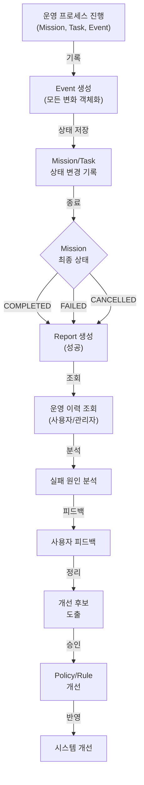
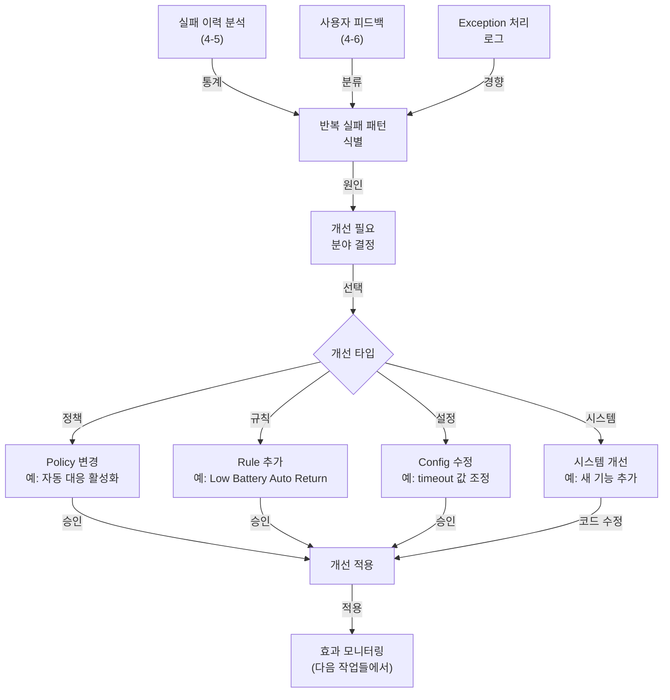

# 기록/분석/개선 프로세스 (Reporting & Analysis)

운영 이력 기록, 분석, 개선 사항 도출의 전체 흐름  
**기반**: [ADR-005](../adr/ADR-005-event-triggered-rule-execution.md) (Event-Based Traceability)

**이 문서에서 준수하는 핵심 원칙**:
- [P9](../core/principles.md#p9-기록-가능성-원칙-traceability) (모든 판단과 결과 기록)
  - 모든 중요한 판단, 승인, 거절, 실패, 결과를 추적 가능하게 기록
  - Event는 단순 로그가 아니라 의사결정의 근거
  - 원인 분석과 사후 개선이 가능해야 함

---

## 프로세스 플로우



---

## 4-1. Event 기록

**시점**: 시스템 전체에서 **의미 있는 모든 사건** 발생 시

**Event 종류**:

| 분류 | Event Type | 예시 | 심각도 |
|------|-----------|------|--------|
| **요청** | USER_COMMAND | 사용자가 "A 구역 촬영" 요청 | INFO |
| **감지** | PROBLEM_DETECTED | 배터리 < 30% 감지 | WARNING |
| **감지** | CRITICAL_HAZARD | 충돌 위험 감지 | CRITICAL |
| **실패** | TASK_FAILED | Task 하드웨어 오류 | WARNING |
| **거절** | USER_COMMAND_FAILED | 수행 불가능한 요청 | INFO |
| **상태** | DEVICE_OFFLINE | Device 10분 이상 응답 없음 | WARNING |
| **의사결정** | PROPOSAL_CREATED | Proposal 생성 | INFO |
| **의사결정** | MISSION_APPROVED | Mission 승인됨 | INFO |
| **의사결정** | AUTO_RESPONSE_TRIGGERED | 자동 대응 실행 | WARNING |

**Event 기록 방식**:

```typescript
Event {
  id: "event-12345",
  
  // 무엇이 일어났는가?
  type: "TASK_FAILED",
  severity: "WARNING",
  status: "OPEN" → "RESOLVED",  // 처리 여부
  
  // 누가 / 무엇에서?
  actor_type: "DEVICE",  // USER / SYSTEM / DEVICE
  actor_id: "rov-1",
  
  target_type: "TASK",  // DEVICE / MISSION / TASK / EVENT ...
  target_id: "task-2",
  
  // 무엇이 문제인가?
  title: "High Resolution Camera Hardware Failure",
  description: "ROV-1의 고해상도 카메라 오류로 Task-2 실패",
  
  // 추가 정보 (Event 타입별로 다름)
  data: {
    mission_id: "mission-1",
    error_type: "HardwareError",
    error_code: "CAM_001",
    retry_count: 0  // 현재까지 재시도 횟수
  },
  
  created_at: "2026-05-12T10:45:00Z",
  updated_at: "2026-05-12T11:15:00Z"  // 상태 변경 시 갱신
}
```

**규칙**:
- 모든 Event는 원본 데이터 보관 (감사 추적)
- Event.data에는 **핵심 메타데이터만** (전체 Proposal/Mission 저장 X)
- Event.status: OPEN (열림) → HANDLED (처리됨) → RESOLVED (해결됨)

---

## 4-2. Mission / Task 기록

**시점**: 상태 변경 시마다

**기록 항목**:

```typescript
Mission {
  id: "mission-1",
  status: "READY" → "IN_PROGRESS" → "FAILED",
  
  // 상태 변경 이력 (자동 기록)
  status_history: [
    { status: "READY", changed_at: "2026-05-12T10:30:00Z" },
    { status: "IN_PROGRESS", changed_at: "2026-05-12T10:31:00Z" },
    { status: "FAILED", changed_at: "2026-05-12T10:45:00Z" }
  ],  // 또는 Event로 기록
  
  // 성공/실패 정보
  result_summary: "Task-2 실패로 전체 미션 중단",
  status_reason: "ROV-1 카메라 하드웨어 오류",
  status_updated_at: "2026-05-12T10:45:00Z"
}

Task {
  id: "task-2",
  status: "PENDING" → "ASSIGNED" → "IN_PROGRESS" → "FAILED",
  
  // 실행 정보
  assigned_device_id: "rov-1",
  assigned_agent_id: "agent-rov-1",
  
  status_updated_at: "2026-05-12T10:45:00Z",  // 마지막 상태 변경 시점
  
  // 결과/오류
  result: {
    captured_duration_sec: 600,
    status_code: "CAM_001",
    images_saved: 500
  },
  error_message: "Camera Hardware Error: Sensor Timeout",
  
  // 재시도 이력
  retry_count: 0,
  last_attempted_at: "2026-05-12T10:45:00Z"
}
```

**상태 이력 관리**:
- Option A: `status_history` 배열로 기록 (구조화)
- Option B: `TASK_STATUS_CHANGED` Event로 기록 (Event-centric)
  ```
  Event {
    type: "TASK_STATUS_CHANGED",
    target_type: "TASK",
    target_id: "task-2",
    data: {
      from_status: "IN_PROGRESS",
      to_status: "FAILED"
    }
  }
  ```

---

## 4-3. Report 생성 / 저장

**시점**: Mission이 최종 상태(COMPLETED/FAILED/CANCELLED)에 도달할 때

**Report 종류**:

| 타입 | 대상 | 용도 |
|------|------|------|
| **MISSION_REPORT** | Mission | 미션 결과 요약 |
| **EVENT_REPORT** | Event | 특정 이벤트 분석 |
| **DAILY_REPORT** | (시간 범위) | 일일 운영 요약 |
| **DEVICE_REPORT** | Device | 장비 운영 현황 |

**Report 생성 예시**:

```typescript
Report {
  id: "report-mission-1",
  
  type: "MISSION_REPORT",
  target_type: "MISSION",
  target_id: "mission-1",
  
  title: "A 구역 고해상도 촬영 - 결과 보고",
  summary: "미션 시작: 10:30, 실패: 10:45 (Task-2 카메라 오류)",
  
  // 상세 정보
  details: {
    mission_id: "mission-1",
    mission_title: "A 구역 고해상도 촬영",
    mission_type: "SURVEY",
    
    // 실행 통계
    total_duration_sec: 900,  // 15분
    task_completed: 1,
    task_failed: 1,
    task_cancelled: 1,
    
    // Task별 상세
    tasks: [
      {
        id: "task-1",
        title: "A 구역으로 이동",
        status: "COMPLETED",
        duration_sec: 300,
        device: "ROV-1"
      },
      {
        id: "task-2",
        title: "고해상도 촬영",
        status: "FAILED",
        duration_sec: 600,
        device: "ROV-1",
        error: "Camera Hardware Error",
        result: {
          images_saved: 500
        }
      }
    ],
    
    // Device 활용
    devices_used: [
      { id: "rov-1", status: "OK", battery_used: 15 }
    ],
    
    // Agent 상태
    agents_used: [
      { id: "agent-rov-1", status: "OK", messages_sent: 42 }
    ],
    
    // 이벤트 요약
    total_events: 23,
    critical_events: 1,
    warning_events: 5,
    
    // 원인 분석
    root_cause: "ROV-1 카메라 센서 타임아웃",
    contributing_factors: [
      "수심 180m에서 신호 간섭 가능성"
    ]
  },
  
  created_by: {
    type: "SYSTEM",
    id: "report-agent"
  },
  
  created_at: "2026-05-12T10:46:00Z"
}
```

**Report Agent의 책임**:
1. Mission/Task/Event 데이터 수집
2. 통계 계산 (성공률, 평균 시간, 오류율)
3. 원인 분석 (실패 원인, 기여 요인)
4. Report 자동 생성 및 저장

---

## 4-4. 운영 이력 조회

**사용자/관리자가 과거 운영 상황을 조회**

### **조회 방식**:

```
대상:
├─ 기간 (2026-05-01 ~ 2026-05-12)
├─ Device (ROV-1)
├─ Mission 유형 (SURVEY)
├─ Event 심각도 (CRITICAL)
└─ 상태 (FAILED)

결과:
├─ Event 목록 (필터링)
├─ Mission 목록 + Report
├─ Task 상세
└─ 통계 (성공률, 평균 시간 등)
```

### **SQL 예시**:

```sql
-- 최근 7일간 실패한 Mission 조회
SELECT m.*, COUNT(t.id) as task_count
FROM missions m
LEFT JOIN tasks t ON m.id = t.mission_id
WHERE m.created_at >= DATE_SUB(NOW(), INTERVAL 7 DAY)
  AND m.status = 'FAILED'
ORDER BY m.created_at DESC;

-- Device별 운영 현황
SELECT d.id, d.name, d.type,
       COUNT(CASE WHEN t.status = 'COMPLETED' THEN 1 END) as success_count,
       COUNT(CASE WHEN t.status = 'FAILED' THEN 1 END) as fail_count,
       -- Task의 평균 실행 시간: 각 Task의 status_updated_at으로 계산
       -- (정확한 시작/종료 시점 추적 필요시 StatusHistory 엔티티 도입 권장)
       AVG(TIMESTAMPDIFF(SECOND, t.created_at, t.status_updated_at)) as avg_duration
FROM devices d
LEFT JOIN tasks t ON d.id = t.assigned_device_id
WHERE t.created_at >= DATE_SUB(NOW(), INTERVAL 30 DAY)
GROUP BY d.id;

-- 모든 CRITICAL Event 조회
SELECT * FROM events
WHERE severity = 'CRITICAL'
  AND created_at >= DATE_SUB(NOW(), INTERVAL 30 DAY)
ORDER BY created_at DESC;
```

---

## 4-5. 실패 원인 분석

**Mission/Task 실패 시 자동으로 원인 분석**

### **분석 흐름**:

```
Mission FAILED
  ↓
Report Agent: 실패 원인 추적
  1. TASK_FAILED Event 확인
  2. Device/Agent 상태 확인
  3. 네트워크/통신 상태 확인
  4. 타임스탬프 분석 (병목 지점)
  ↓
원인 분류:
├─ Device Error (H/W 오류)
│   └─ 카메라 센서 타임아웃
├─ Communication Error (통신 문제)
│   └─ 신호 약화, 지연 증가
├─ Environmental Error (환경 문제)
│   └─ 수심 초과, 조류 강화
├─ Software Error (시스템 오류)
│   └─ 타임아웃, 메모리 부족
└─ Human Error (인적 오류)
    └─ 잘못된 파라미터
  ↓
기여 요인 분석
  - 이전 작업의 누적 피로
  - 배터리 부족
  - AgentConnection 신호 약화
  - 동시 다중 작업 부하
  ↓
Report에 기록
```

### **자동 분석 규칙**:

```typescript
Rule {
  name: "Task Failure Root Cause Analysis",
  trigger: "TASK_FAILED Event",
  analysis: [
    {
      condition: "error_code == 'CAM_001'",
      root_cause: "Camera Sensor Timeout",
      contributing_factors: [
        "current_depth > 150m",
        "signal_strength < -80dBm",
        "device_age > 1000_hours"
      ]
    },
    {
      condition: "task.timeout_occurred",
      root_cause: "Timeout (device communication delayed)",
      contributing_factors: [
        "network_latency > 2000ms",
        "last_heartbeat_delay > 5000ms"
      ]
    }
  ]
}
```

---

## 4-6. 사용자 피드백 수집

**사용자가 Mission 결과에 대한 피드백 입력**

### **피드백 수집 지점**:

```
Report 조회
  ↓
사용자: "이 결과는 어떤가요?"
  ├─ "예상과 다름"
  ├─ "시간이 너무 오래 걸렸음"
  ├─ "장비 성능 미흡"
  └─ "개선 가능한 부분이 있음"
  ↓
피드백 저장
  {
    type: "USER_FEEDBACK",
    target: "mission-1",
    rating: 3,  // 1-5점
    feedback_text: "결과는 좋은데, 시간이 30분 더 걸렸음"
  }
  ↓
Event 기록 (또는 Report.details에 추가)
```

### **현재 구현 방식**:

초기 단계에는 Event 또는 Report.details에 피드백 기록:
```typescript
Event {
  type: "USER_FEEDBACK",
  target_type: "REPORT",
  target_id: "report-mission-1",
  data: {
    rating: 3,
    feedback: "시간이 길었음",
    category: "PERFORMANCE"
  }
}
```

향후 피드백이 중요해지면 별도 Feedback 데이터 모델 추가 가능.

---

## 4-7. 개선 후보 정리

**실패, 반복 문제, 피드백을 바탕으로 개선 항목 도출**

### **개선 후보 도출 흐름**:



### **개선 후보 예시**:

```
문제: 배터리 부족으로 인한 Mission 실패 (지난 30일간 5회)
  ↓
원인: 사용자가 배터리 수준을 무시하고 작업 요청
  ↓
개선 후보 1:
  - 변경: Policy (자동 대응 강화)
  - 내용: 배터리 < 20%일 때 자동으로 RETURN_TO_BASE Mission 생성
  - 영향: 사용자 승인 불필요, 더 높은 신뢰성
  - 위험: 사용자가 원하지 않는 시점에 작업 중단

개선 후보 2:
  - 변경: Config (임계값 조정)
  - 내용: min_battery_for_task를 30%에서 50%로 상향
  - 영향: 더 많은 작업이 "불가능" 판정
  - 위험: 유휴 장비 증가

개선 후보 3:
  - 변경: Rule (경고 강화)
  - 내용: 배터리 < 30%이면 Proposal 생성 시 경고 표시
  - 영향: 사용자 인식 개선
  - 위험: 무시될 수 있음
```

### **개선 추적**:

```typescript
Improvement {
  id: "improvement-1",
  
  title: "Auto-Return Policy for Low Battery",
  description: "배터리 < 20%일 때 자동 기지 복귀",
  
  // 개선 근거
  source: "실패 패턴 분석",
  failure_incidents: 5,  // 지난 30일 5회 실패
  affected_missions: ["mission-1", "mission-3", ...],
  
  // 개선 내용
  improvement_type: "POLICY_CHANGE",  // RULE / CONFIG / SYSTEM
  change: {
    target: "Policy: Low Battery Auto Response",
    from: { enabled: false },
    to: { enabled: true }
  },
  
  // 예상 효과
  expected_impact: "배터리 부족으로 인한 Mission 실패 80% 감소",
  risk_assessment: "사용자가 예기치 않게 작업 중단 가능",
  
  // 승인
  status: "PROPOSED" → "APPROVED" → "APPLIED",
  approved_by: "admin-001",
  approved_at: "2026-05-15T10:00:00Z",
  
  // 모니터링
  applied_at: "2026-05-15T14:00:00Z",
  monitoring_period_days: 14,
  effectiveness: "TBD"  // 적용 후 평가
}
```

### **개선 프로세스**:

```
1. 개선 후보 식별 (분석)
   ↓
2. 관리자 검토 (토론)
   ↓
3. 승인 (결정)
   ↓
4. 적용 (실행)
   ├─ Policy/Rule 변경 (코드 수정 X)
   └─ System 개선 (코드 수정)
   ↓
5. 모니터링 (효과 평가)
   ├─ 문제 발생? → 롤백
   └─ 효과 있음? → 확정
   ↓
6. 차기 개선 계획 수립
```

---

## 참고

- **[ADR-005](../adr/ADR-005-event-triggered-rule-execution.md)**: Event-Triggered 원칙
- **[ADR-006](../adr/ADR-006-adaptive-autonomy-migration-path.md)**: Policy/Rule/Config 조정
- **[schema.md](../core/schema.md)**: Event, Report, Mission, Task 스키마
- **[operation.md](operation.md)**: 운영 프로세스
- **[lifecycle.md](lifecycle.md)**: 생명주기
- **[administration.md](administration.md)**: 관리/설정 프로세스
